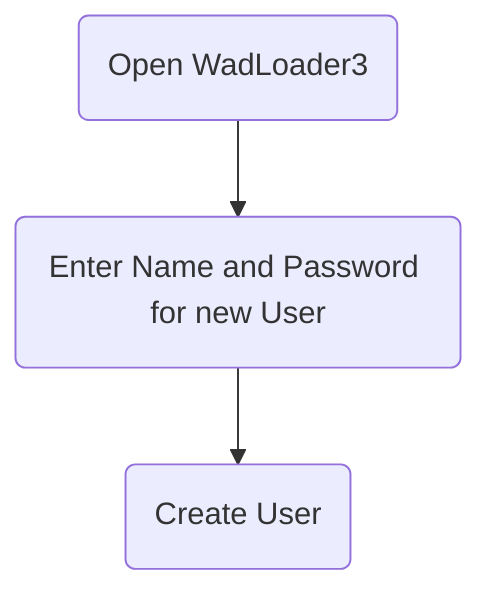
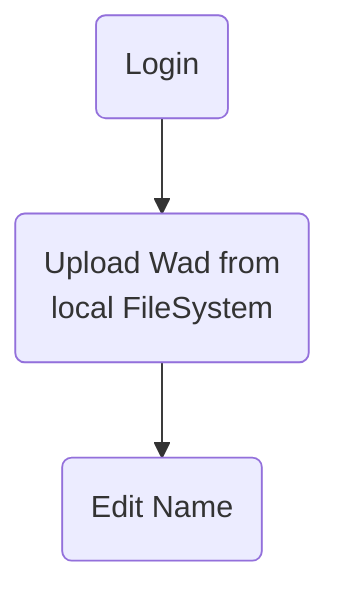
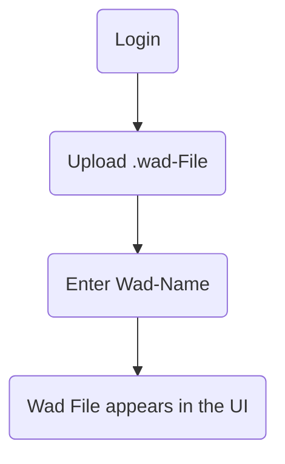
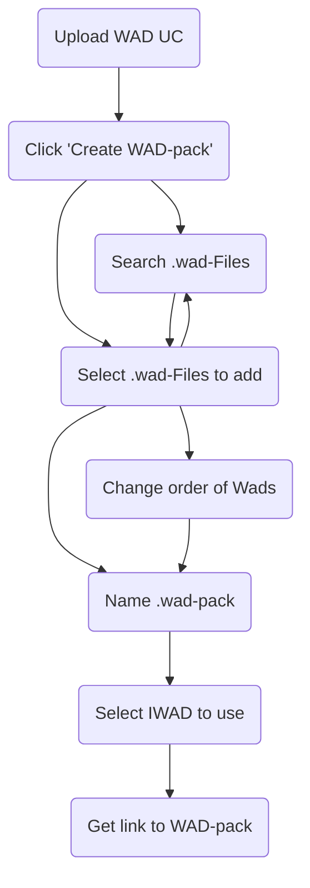
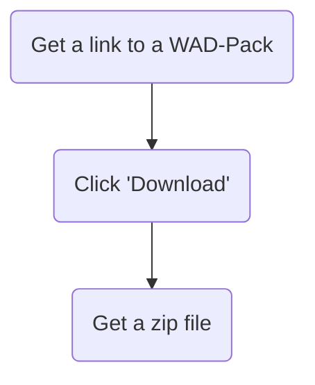
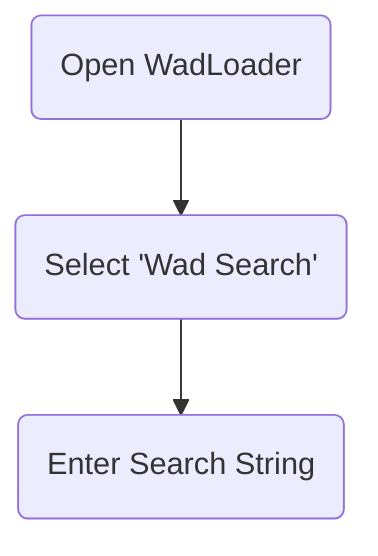
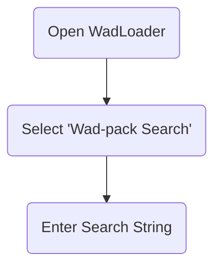

# Detaillierte Problemstellung

WAD-Dateien (Where's All the Data) sind Container für Ressourcen, die in der Doom-Engine genutzt werden. Diese Dateien sind essenziell für die Anpassung und Erweiterung des Spiels Doom. Die vorliegende Problemstellung dreht sich um die Entwicklung einer Webanwendung namens WadLoader. Diese ermöglicht es, WAD-Dateien hochzuladen, zu organisieren und herunterzuladen. Oft werden mehrere WADs zusammen verwendet, um verschiedene Szenarien oder Mods zu erstellen. Das Hauptziel der Anwendung ist es, eine benutzerfreundliche Oberfläche bereitzustellen, um diese Dateien zu verwalten und sie in Form von Modpacks (auch WAD-Packs) zu organisieren.

# Anwendungsfälle (Use Cases)

### Benutzer erstellen (Create User UC)

### Anmeldung (Login UC)

### WAD hochladen (Upload WAD UC)

### WAD-Paket erstellen (Create WAD Pack UC)

### WAD-Pakete herunterladen (Download WAD Packs UC)

### WADs durchsuchen (Browse Wads)

### WAD-Pakete durchsuchen (Browse Wad-Packs)

# Muss-/Kann-Kriterien

Die Anwendung muss folgende Kriterien erfüllen:

- Benutzerregistrierung und -authentifizierung
- Hochladen und Verwalten von WAD-Dateien
- Erstellen, Bearbeiten und Herunterladen von WAD-Paketen
- Durchsuchen und Filtern von WAD-Dateien und -Paketen
- Integration einer geeigneten Datenbank für Persistenz

Kann-Kriterien umfassen:

- Unterstützung für mehrere Benutzerrollen (Administrator, Standardbenutzer)
- Erweiterte Such- und Filteroptionen für WAD-Dateien
- Integration von OAuth für externe Anmeldungsoptionen
- Starten von WAD-Packs aus dem Browser heraus

## Umgesetze Kriterien

Es wurden alle Muss-Kriterien implementiert. Benutzer können sich beim WadLoader registrieren und anmelden [x]. WADs können hochgeladen und mit anderen Nutzern geteilt werden [x]. Es ist möglich WAD-Packs zu Erstellen, zu Bearbeiten und Herunterzuladen [x]. Alle WAD-Packs können mittels einer Suchfunktion gefiltert werden [x]. Alle Änderungen werden durch eine Datenbank persitiert, somit bleiben diese auch nach einem Neustart oder Absturz der Servers erhalten [x].

Zusätzlich wurden auch die meisten Kann-Kriterien erfüllt. Such- und Filterfunktionalität steht auch für WADs zu ferfügunh [x]. Das Anmelden mittels OAuth ist möglich. Zudem können auch bereits existierende Account von externen OAuth-Anbietern (Google, Github, etc.) zum Anmelden und Registieren genutzt werden [x].

# Technologieauswahl

Im folgenden wird der Einsatz der genutzen Technologien begründet.

## Begründung H2

Eine H2-Datenbank lässt sich, dank bereits existierender Integration in Spring Boot mit minimalem Aufwand einsetzen. Für das benötigte Datenmodell ist eine In-Memory-Datenbank vorerst ausreichend. Die Nutzung einer In-Memory-DB vereinfacht das Aufsetzen der Laufzeitumgebung, da keine eigene Datenbank installiert oder anderweitigt (z.B. über Docker) bereitgestellt werden muss. Durch eine saubere Trennung der Persistenzschciht von der Domände, kann die H2-Datenbank ohne Änderungen am Kern der Anwendung ausgetauscht werden.

## Begründung Spring Boot

Spring Boot ist für Java-Webanwendungen eine beliebte Wahl, da es mit geringem Konfigurationsaufwand einsetzbar ist und das schnelle Erstellen komplexer Anwendungen ermöglilcht. Ein breites Spekturm an Spring Integrationen ermöglicht die nathlose Verwendung vieler anderer Frameworks und Bibliotheken. 

Die vergleichsweise langsamen Startzeit von Spring Boot sind bei Anwendungen dieser größe noch im einstelligen Sekundenbereich. Das Ausführen des Servers ist also auch auf älteren Geräten möglich. 

## Begründung React mit TypeScript

Eine beliebte Option zum Erstelllen modernen Single Page Applications ist React. Mit Material UI verfügt React über eine möchtige UI Bibliothek zum einfachen Erstellen von optisch ansprechenden Webseiten. 

Die Verwendung von TypeScript fördert die Wartbarkeit von React-Anwendungen ungemein. TypeScript hilft auch bei der Suche und dem Vermeiden von Fehlern.

## Begründung Haskell

Haskell wird in diesem Projekt für den Client Handler verwendet. Dies geschieht hauptsächlich aus Experimientierfreudigkeit heraus. Es soll getestet werden, wie viel Aufwand notwendig ist um stark auf IO basierende Funktionalität in Haskell abzubilden.

Die Nutzung von Haskell bietet aber auch Vorteile. Haskell kann als plattformunabhängige Programmiersprache zum Erzeugen von nativ ausführbaren Artefakten genutzt werden. Für die Verwendung des Client Handlers ist also keine Installation von Drittprogammen notwendig.

Die Nutzung von Java oder Python würde beispielsweise die Installation einer Java bzw. Python Laufzeit erfordern. Alternativ könnte die Entsprechende Laufzeitumgebung auch mit dem Handler ausgeliefert werden, was den Client Handler jedoch aufblähen würde.

## Begründung Auth0

Authentifizierung und Autorisierung ist ein sehr komplexes und sensibles Gebiet. Das Implementieren eines OAuth2 Flows ist nicht trivial. Deswegen wird Auth0, ein Anbieter für Authentication und Authorization als Service, genutzt.

Dadurch müssen vom WadLoader keine Userdaten verwaltet werden. Das Anmelden über bereits bestehende Konten (z.B. GitHub) ist möglich.

Die Nutzung von Auth0 reduziert also den Entwicklungsaufwand und bringt zusätzliche viele Vorteile.

# Architekturmodelle

## Spring-Boot-Backend

Das Backend ist nach der Onion-Architektur strukturiert, um eine klare Trennung von Geschäftslogik und Infrastruktur zu gewährleisten. Diese Architektur fördert eine modulare und erweiterbare Codebasis, indem sie Schichten definiert, die sich um das zentrale Domänenmodell gruppieren.

### Infrastruktur

Die Infrastrukturschicht bildet die äußerste Schicht und enthält Implementierungen für datenbankbezogene Operationen, Dateimanagement und externe Schnittstellen. Beispielsweise umfasst sie die Implementierungen für das Zippen von Dateien oder das Verwalten des Dateisystems auf dem Server.

### API

In der API-Schicht werden die Controller definiert, die die REST-Schnittstellen zur Kommunikation mit dem Frontend und dem Client-Handler bereitstellen. Diese Schicht verwaltet auch die Umwandlung von Domain-Objekten in DTOs (Data Transfer Objects), die über das Netzwerk übertragen werden.

### Domain/Core

Die Domänenschicht bildet das Herzstück der Anwendung und enthält die Geschäftslogik sowie die zentralen Entitäten wie Wads und WadPacks. Hier werden die Kernoperationen definiert, die die Anwendungslogik implementieren und auf die Infrastrukturschicht zugreifen.

### Abstraktion

Die Abstraktionsschicht bietet allgemeine Dienste und Funktionen an, die von verschiedenen Teilen der Anwendung genutzt werden können. Beispielsweise können hier generische Dienste für fehlerresistente Operationen oder Logging implementiert werden, die nicht direkt an eine spezifische Domänenlogik gebunden sind.

/filters:no_upscale()/news/2014/10/ddd-onion-architecture/en/resources/onion-architecture.png)

### Funktionsweise

Wads werden als immutable Daten angesehen. Das hat den Vorteil, dass es nicht zu Inkonsistenzen kommen kann, wenn einzelne Wads gelöscht oder geupdatet werden. Das Löschen von Wads würde die Konsistenz von WadPacks zerstören, die den Wad genutzt haben. Beim Updaten von Wads kann es, wie beim Updaten von Software, zu Fehlern und Inkonsistenzen kommen.

WadPacks können beliebig bearbeitet werden. Deswegen werden beim Herunterladen und Starten eines WadPacks, das Vorhandensein aller benötigten Wads geprüft und ein neues Startscript heruntergeladen.

## Client Handler

Die folgende Grafik gibt eine grobe Übersicht über die Abläufe im Client Handler.

Aus den Parametern des Programmes ergibt sich eine **Action**. Diese ist eine Anweisung, welche Wads und welches Start-Skript (für ein WadPack) herunterzuladen sind. Zudem enthält die Action die URL des Servers, welcher zum Herunterladen der Wads verwendet werden soll.

Aus der Liste der benötigten Wads werden diejenigen ermittelt, welche dem Client noch nicht lokal zur Verfügung stehen.

Die Liste der noch herunterzuladenden Wads wird mit der ID des WadPacks an die URL des Servers weitergeleitet.

Der Server antwortet auf diese Anfrage mit einer .zip Datei. Diese enthält alle angeforderten Wads und eine .cmd Datei, welche das WadPack startet. Diese .cmd Datei wird zum Ausführen eines einzelnen WadPacks genutzt.

Bei der Entwicklung des Client Handlers wurden Best Practices der Funktionalen Programmierung genutzt. Dazu gehört beispielsweise das Schieben von IO Operationen an den Rand der Anwendung. Die meisten Operationen des Kerns der Anwendung sind also pure.

# Screenshots und Zustände

## Create WAD

Hier ist ein Screenshot der "Create WAD"-Seite im WadLoader-Projekt. Diese Seite ermöglicht es dem Benutzer, ein neues WAD-File hochzuladen und einen Namen und eine Beschreibung dafür einzugeben.

## Create WAD Pack

Dies ist ein Beispiel für die "Create WAD Pack"-Seite. Der Benutzer kann ausgewählte WAD-Files zu einem Paket zusammenstellen, die Reihenfolge ändern und dem Paket einen Namen und eine Beschreibung geben.

## WAD List

Hier ist die Ansicht der "WAD List", die dem Benutzer ermöglicht, nach WAD-Dateien zu suchen und sie herunterzuladen.

# Anwendung ausführen

## Setup

Notwendige Einrichtung, um das Programm auszuführen. Das Festlegen von localhost:3000 ist nur erforderlich, wenn das Frontend von Vite bereitgestellt werden soll. Dies bietet sich hauptsächlich während der Entwicklung an.

1. Erstellen eines Authentifizierungsprojekts bei auth0
    * Erstellen eines kostenlosen Kontos unter https://auth0.com
    * Erstellen einer neuen "Regular Web Application"
    * Hinzufügen von "Allowed Callback URLs": http://localhost:8080/login/oauth2/code/okta
    * Hinzufügen von "Allowed Logout URLs": http://localhost:3000, http://localhost:8080
    * Hinzufügen von "Allowed Web Origins": http://localhost:3000, http://localhost:8080
    * Aktivieren von "Allow Cross-Origin Authentication" und

 Hinzufügen von Ursprüngen: "http://localhost:3000, http://localhost:8080"
2. Erstellen der Datei src/main/resources/application-local.properties
3. Hinzufügen von Einträgen für (okta.XXX-Werte stammen aus dem zuvor erstellten auth0-Projekt):
    * spring.datasource.username
    * spring.datasource.password
    * okta.oauth2.issuer
    * okta.oauth2.client-secret
    * okta.oauth2.client-id

## Anwendung bauen

Erforderliche Werkzeuge:
* Java: 21
* Haskell: GHC2021 (\*)
* Node: 20 (niedrigere Versionen sollten auch funktionieren)
* npm (js/ts-Build-Tool)
* yalc (Manager für lokale npm-Pakete, kann über npm installiert werden)
* Maven (Java-Build-Tool)
* Cabal (Haskell-Build-Tool, empfohlene Installation über ghcup, \*)

\* nur notwendig, wenn Änderungen am Haskell Code vorliegen
Die folgenden Schritte helfen Ihnen, eine ausführbare Jar-Datei zu erstellen. Alle Schritte setzen das Stammverzeichnis des Repositories als Startverzeichnis voraus. 

### API bauen

1. cd ./api-generator
2. npm install
3. npm run generate
4. npm run update

### Haskell-Client bauen (kann ausgelassen werden, wenn keine Änderungen am Haskell-Code vorgenommen wurden)

1. cd ./local-client
2. cabal build
3. cp ./dist-newstyle/build/x86_64-windows/ghc-9.4.8/local-client-0.1.0.0/x/local-client/build/local-client/local-client.exe ../wadloader3/src/main/resources/local-client.exe

### Backend und Frontend bauen

1. cd ./wadloader3
2. yalc add wadloader3-api
3. npm install
4. npm run build
5. mvn package

## Server starten

Starten Sie die Anwendung ohne zusätzliche Parameter.

## Anwendung als Benutzer einrichten

1. Anmeldung
2. Herunterladen des Setup-Skripts (durch Klicken auf die Schaltfläche zum Herunterladen oder Aufrufen von /download/setup)
3. Ausführen des Setup-Skripts mit Administratorrechten (es kann sich auch selbst erhöhen)

Optional (wenn Sie diese nicht setzen, werden Sie jedes Mal nach ihren Werten gefragt, wenn Sie ein WadPack starten):
4. Setzen Sie %GZDOOM_PATH% auf den Pfad zu Ihrer gzdoom.exe
5. Setzen Sie %IWAD_PATH% auf den Pfad des IWAD, den Sie zum Starten Ihrer WadPacks verwenden möchten

# Zukünftige Erweiterungen

1. Unterstützung für zusätzliche Spiel-Engines neben der Doom-Engine.
2. Erweiterte Benutzerrollen und Berechtigungssysteme.
3. Unterstützung für Cloud-Speicher zur Verwaltung von WAD-Dateien.
4. Verbesserte Such- und Filterfunktionen.
5. Integration von Social Features wie Bewertungen und Kommentare zu WADs.
6. Mobile App zur Verwaltung von WAD-Dateien unterwegs.

# Sicherheit

1. Implementierung von Sicherheitsmaßnahmen wie SSL/TLS für die Datenübertragung.
2. Regelmäßige Sicherheitsupdates und Patches.
3. Überprüfung und Validierung von hochgeladenen WAD-Dateien.
4. Schutz vor Brute-Force-Angriffen und anderen bösartigen Aktivitäten.

# Leistungsoptimierungen

1. Caching von häufig verwendeten Daten.
2. Optimierung der Datenbankabfragen.
3. Lastverteilung für den Serverbetrieb.
4. Überwachung und Profiling der Anwendung zur Identifizierung von Engpässen.

# Deployment

1. Einsatz von CI/CD-Pipelines für automatisierte Builds und Tests.
2. Verwendung von Docker für eine konsistente und portable Deployment-Umgebung.
3. Bereitstellung in einer Cloud-Umgebung für Skalierbarkeit und Zuverlässigkeit.
4. Regelmäßige Backups und Wiederherstellungstests.

# Dokumentation und Benutzerhandbuch

1. Erstellung eines umfassenden Benutzerhandbuchs mit Schritt-für-Schritt-Anleitungen.
2. Bereitstellung von API-Dokumentationen für Entwickler.
3. Erstellen von Video-Tutorials und Demos zur Veranschaulichung der wichtigsten Funktionen.
4. Einrichten eines Support-Systems für Benutzerfragen und -probleme.
