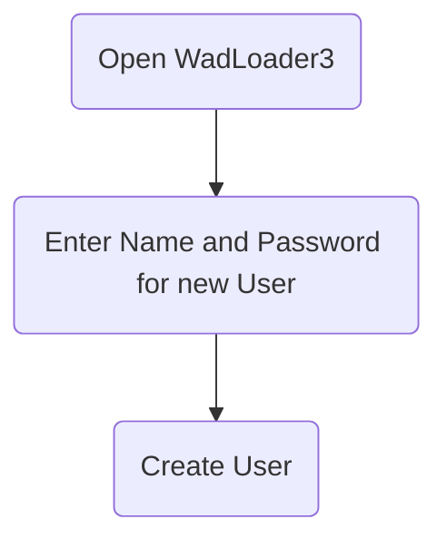
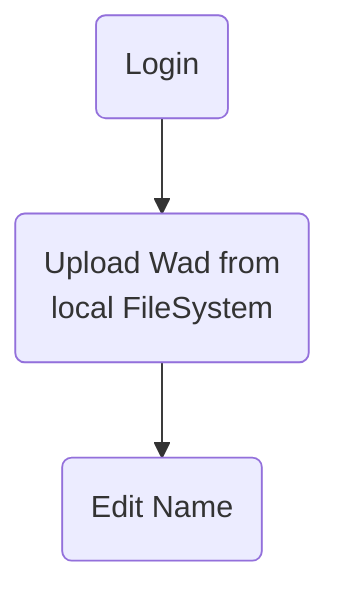
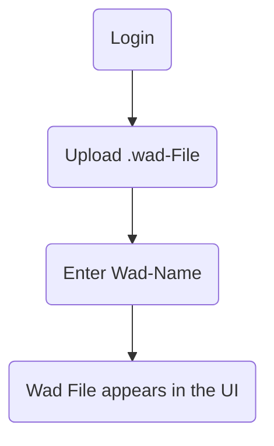
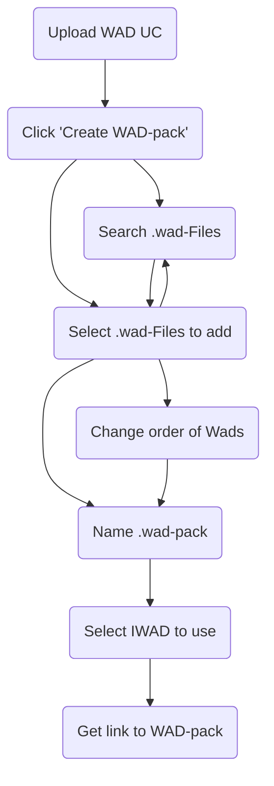
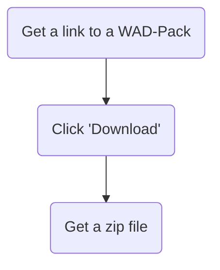
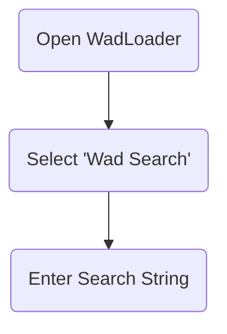
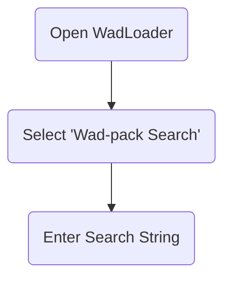

# Detaillierte Problemstellung

WAD-Dateien (Where's All the Data) sind Container für Ressourcen, die in der Doom-Engine genutzt werden. Diese Dateien sind essenziell für die Anpassung und Erweiterung des Spiels Doom. Die vorliegende Problemstellung dreht sich um die Entwicklung einer Webanwendung namens WadLoader. Diese ermöglicht es, WAD-Dateien hochzuladen, zu organisieren und herunterzuladen. Oft werden mehrere WADs zusammen verwendet, um verschiedene Szenarien oder Mods zu erstellen. Das Hauptziel der Anwendung ist es, eine benutzerfreundliche Oberfläche bereitzustellen, um diese Dateien zu verwalten und sie in Form von Modpacks (auch WAD-Packs) zu organisieren.

# Anwendungsfälle (Use Cases)

### Benutzer erstellen (Create User UC)

### Anmeldung (Login UC)

### WAD hochladen (Upload WAD UC)

### WAD-Paket erstellen (Create WAD Pack UC)

### WAD-Pakete herunterladen (Download WAD Packs UC)

### WADs durchsuchen (Browse Wads)

### WAD-Pakete durchsuchen (Browse Wad-Packs)

# Muss-/Kann-Kriterien

Die Anwendung muss folgende Kriterien erfüllen:

- Benutzerregistrierung und -authentifizierung
- Hochladen und Verwalten von WAD-Dateien
- Erstellen, Bearbeiten und Herunterladen von WAD-Paketen
- Durchsuchen und Filtern von WAD-Dateien und -Paketen
- Integration einer geeigneten Datenbank für Persistenz

Kann-Kriterien umfassen:

- Unterstützung für mehrere Benutzerrollen (Administrator, Standardbenutzer)
- Erweiterte Such- und Filteroptionen für WAD-Dateien
- Integration von OAuth für externe Anmeldungsoptionen
- Starten von WAD-Packs aus dem Browser heraus

## Umgesetzte Kriterien

Es wurden alle Muss-Kriterien implementiert. Benutzer können sich beim WadLoader registrieren und anmelden [x]. WADs können hochgeladen und mit anderen Nutzern geteilt werden [x]. Es ist möglich, WAD-Packs zu erstellen, zu bearbeiten und herunterzuladen [x]. Alle WAD-Packs können mittels einer Suchfunktion gefiltert werden [x]. Alle Änderungen werden durch eine Datenbank persistiert, somit bleiben diese auch nach einem Neustart oder Absturz des Servers erhalten [x].

Zusätzlich wurden auch die meisten Kann-Kriterien erfüllt. Such- und Filterfunktionalität steht auch für WADs zur Verfügung [x]. Das Anmelden mittels OAuth ist möglich. Zudem können auch bereits existierende Accounts von externen OAuth-Anbietern (Google, Github, etc.) zum Anmelden und Registrieren genutzt werden [x].

# Technologieauswahl

Im Folgenden wird der Einsatz der genutzten Technologien begründet.

## Begründung H2

Eine H2-Datenbank lässt sich dank der Integration in Spring Boot mit minimalem Aufwand einsetzen. Da das zu persistierende Datenmodell klein ist (zwei Entitäten), ist H2 vorerst ausreichend. Zusätzlich haben wir bereits umfangreiche Erfahrung im Umgang mit H2, was die Implementierung und Wartung erleichtert. Bei Bedarf kann die Datenbank einfach durch eine andere ersetzt werden, was uns Flexibilität für zukünftige Erweiterungen bietet. H2 ist zudem ideal für Entwicklungs- und Testumgebungen, da sie schnell und ressourcenschonend ist. Eine In-Memory-Datenbank vereinfacht das Aufsetzen der Laufzeitumgebung, da keine eigene Datenbank installiert oder anderweitig (z.B. über Docker) bereitgestellt werden muss. Durch eine saubere Trennung der Persistenzschicht von der Domäne kann die H2-Datenbank ohne Änderungen am Kern der Anwendung ausgetauscht werden.

## Begründung Spring Boot

Spring Boot ist für Java-Webanwendungen eine beliebte Wahl, da es plattformunabhängig ist und das Bereitstellen unter verschiedenen Betriebssystemen erleichtert. Unsere Teammitglieder verfügen über fundierte Kenntnisse in Spring Boot, und wir möchten diese weiter ausbauen. In vielen Unternehmen, in denen wir tätig sind, wird Spring Boot aufgrund seiner Robustheit und des umfangreichen Ökosystems verwendet. Dies verschafft uns berufliche Vorteile. Darüber hinaus ermöglicht Spring Boot eine schnelle Entwicklung und Bereitstellung von Anwendungen durch seine konventionsbasierten Konfigurationsmöglichkeiten. Ein breites Spektrum an Spring-Integrationen ermöglicht die nahtlose Verwendung vieler anderer Frameworks und Bibliotheken. Die vergleichsweise langsamen Startzeiten von Spring Boot sind bei Anwendungen dieser Größe noch im einstelligen Sekundenbereich. Das Ausführen des Servers ist also auch auf älteren Geräten möglich.

## Begründung React/TS

React mit TypeScript ermöglicht die Entwicklung moderner Webanwendungen mit Material UI für ein konsistentes Benutzererlebnis. Wir haben bereits umfangreiche Erfahrung in der Entwicklung mit React und TypeScript. React ist in vielen Unternehmen weit verbreitet und verbessert unsere beruflichen Fähigkeiten. TypeScript bietet statische Typisierung, die die Codequalität und Wartbarkeit erhöht. Die Verwendung von Material UI sorgt für ein einheitliches und ansprechendes Design. Diese Kombination ermöglicht uns eine effiziente und fehlerarme Entwicklung.

## Begründung Haskell

Haskell wird in diesem Projekt für den Client Handler verwendet. Dies geschieht hauptsächlich aus Experimentierfreudigkeit heraus. Es soll getestet werden, wie viel Aufwand notwendig ist, um stark auf IO-basierende Funktionalität in Haskell abzubilden. Haskell bietet sich für den Client Handler an, da es plattformunabhängig ist und ohne zusätzliche Interpreter nativ ausführbar ist. Darüber hinaus besteht im Team bereits umfangreiches Vorwissen im Bereich Haskell, was die Entwicklung erleichtert. Die Nutzung von Haskell dient zudem als Prüfungsvorbereitung für die Klausur in der Vorlesung Programmierparadigmen. Haskells starke Typensicherheit und funktionale Programmierparadigmen ermöglichen eine saubere und wartbare Codebasis, was insbesondere bei komplexen Anwendungen wie dem WadLoader von Vorteil ist. Die Nutzung von Java oder Python würde beispielsweise die Installation einer Java- bzw. Python-Laufzeit erfordern. Alternativ könnte die entsprechende Laufzeitumgebung auch mit dem Handler ausgeliefert werden, was den Client Handler jedoch aufblähen würde.

## Begründung Auth0

Authentifizierung und Autorisierung ist ein sehr komplexes und sensibles Gebiet. Das Implementieren eines OAuth2-Flows ist nicht trivial. Deswegen wird Auth0, ein Anbieter für Authentication und Authorization als Service, genutzt. Dadurch müssen vom WadLoader keine Userdaten verwaltet werden. Das Anmelden über bereits bestehende Konten (z.B. GitHub) ist möglich. Die Nutzung von Auth0 reduziert also den Entwicklungsaufwand und bringt zusätzlich viele Vorteile.

# Architekturmodelle

## Spring-Boot-Backend

Das Backend ist nach der Onion-Architektur strukturiert, um eine klare Trennung von Geschäftslogik und Infrastruktur zu gewährleisten. Diese Architektur fördert eine modulare und erweiterbare Codebasis, indem sie Schichten definiert, die sich um das zentrale Domänenmodell gruppieren.

### Infrastruktur

Die Infrastrukturschicht bildet die äußerste Schicht und enthält Implementierungen für datenbankbezogene Operationen, Dateimanagement und externe Schnittstellen. Beispielsweise umfasst sie die Implementierungen für das Zippen von Dateien oder das Verwalten des Dateisystems auf dem Server.

### API

In der API-Schicht werden die Controller definiert, die die REST-Schnittstellen zur Kommunikation mit dem Frontend und dem Client-Handler bereitstellen. Diese Schicht verwaltet auch die Umwandlung von Domain-Objekten in DTOs (Data Transfer Objects), die über das Netzwerk übertragen werden.

### Domain/Core

Die Domänenschicht bildet das Herzstück der Anwendung und enthält die Geschäftslogik sowie die zentralen Entitäten wie Wads und WadPacks. Hier werden die Kernoperationen definiert, die die Anwendungslogik implementieren und auf die Infrastrukturschicht zugreifen.

### Abstraktion

Die Abstraktionsschicht bietet allgemeine Dienste und Funktionen an, die von verschiedenen Teilen der Anwendung genutzt werden können. Beispielsweise können hier generische Dienste für fehlerresistente Operationen oder Logging implementiert werden, die nicht direkt zur Geschäftslogik gehören.

## React/Typescript-Frontend

Das Frontend ist in React mit TypeScript implementiert und nutzt Material UI für die Gestaltung der Benutzeroberfläche. Es gibt verschiedene Komponenten und Services, die für die unterschiedlichen Funktionalitäten zuständig sind.

### Components

Die Komponenten sind die Bausteine der Benutzeroberfläche. Sie repräsentieren verschiedene Teile der Anwendung wie das Hochladen von WAD-Dateien, das Erstellen von WAD-Packs oder die Benutzeranmeldung. Jede Komponente ist in sich abgeschlossen und kann bei Bedarf wiederverwendet werden.

### Services

Die Services sind für die Kommunikation mit dem Backend und das Management der Applikationslogik zuständig. Sie stellen Methoden bereit, um API-Aufrufe zu tätigen, Benutzerdaten zu verwalten und die Anwendungskonfiguration zu handhaben.

### Router

Der Router verwaltet die Navigation innerhalb der Anwendung. Er stellt sicher, dass Benutzer zu den verschiedenen Ansichten der Anwendung navigieren können, z.B. zum Hochladen von WADs oder zum Durchsuchen von WAD-Packs.

## Client-Handler

Der Client-Handler, implementiert in Haskell, übernimmt die Kommunikation mit dem WadLoader-Backend. Er fungiert als Proxy zwischen dem Benutzer und dem Backend und kümmert sich um Aufgaben wie das Hochladen und Herunterladen von WAD-Dateien. Die Nutzung von Haskell ermöglicht es, die robusten und sicheren funktionalen Programmierparadigmen zu nutzen, was insbesondere bei der Entwicklung von Netzwerkdiensten von Vorteil ist.

# Testkonzept

## Teststrategien

Für die Sicherstellung der Qualität der WadLoader-Anwendung werden verschiedene Teststrategien eingesetzt:

### Unit-Tests

Unit-Tests sind klein und isoliert. Sie testen einzelne Komponenten der Anwendung, wie z.B. Services und Controller. Jeder Unit-Test konzentriert sich auf eine spezifische Funktionalität und überprüft deren Verhalten anhand von Mock-Objekten und Stubs, um Abhängigkeiten zu isolieren.

### Integrationstests

Integrationstests überprüfen die Zusammenarbeit mehrerer Komponenten. Beispielsweise wird getestet, ob die Interaktion zwischen dem Spring Boot Backend und der H2-Datenbank korrekt funktioniert. Diese Tests verwenden in der Regel eine in-memory H2-Datenbank, um eine realistische Testumgebung zu schaffen, ohne externe Ressourcen zu benötigen.

### End-to-End-Tests (E2E)

End-to-End-Tests überprüfen das gesamte System vom Frontend bis zum Backend. Sie simulieren Benutzerinteraktionen und stellen sicher, dass die Anwendung als Ganzes korrekt funktioniert. Tools wie Cypress oder Selenium können verwendet werden, um diese Tests zu automatisieren.

### Akzeptanztests

Akzeptanztests validieren, ob die Anwendung die Geschäftsanforderungen erfüllt. Diese Tests werden häufig in Zusammenarbeit mit Stakeholdern erstellt und überprüft. Sie fokussieren sich darauf, reale Anwendungsfälle abzudecken und sicherzustellen, dass die Benutzeranforderungen vollständig umgesetzt sind.

### Manuelle Tests

Manuelle Tests ergänzen die automatisierten Tests und werden für exploratives Testen und zur Überprüfung von Benutzeroberflächen verwendet. Diese Tests helfen dabei, unerwartete Probleme zu entdecken und sicherzustellen, dass die Benutzererfahrung reibungslos ist.

## Testwerkzeuge

Zur Umsetzung dieser Teststrategien werden verschiedene Werkzeuge eingesetzt:

- **JUnit**: Für Unit- und Integrationstests im Spring Boot Backend.
- **Mockito**: Für das Mocking von Abhängigkeiten in Unit-Tests.
- **Cypress/Selenium**: Für End-to-End-Tests der Webanwendung.
- **Postman**: Für manuelle Tests der API-Endpunkte.
- **Jenkins**: Für kontinuierliche Integration und automatisierte Ausführung der Tests.

# Fazit

Der WadLoader stellt eine umfassende Lösung für das Management von WAD-Dateien dar. Die Kombination aus einem robusten Spring Boot Backend, einem modernen React/TypeScript Frontend und einem effizienten Haskell-basierten Client-Handler gewährleistet eine leistungsstarke und benutzerfreundliche Anwendung. Durch den Einsatz verschiedener Teststrategien und -werkzeuge wird die Qualität und Zuverlässigkeit der Anwendung sichergestellt. Zukünftige Erweiterungen und Anpassungen können dank der modularen Architektur problemlos umgesetzt werden. Die Wahl der Technologien ermöglicht es dem Team, ihre Fähigkeiten weiterzuentwickeln und gleichzeitig eine stabile und skalierbare Lösung bereitzustellen.
