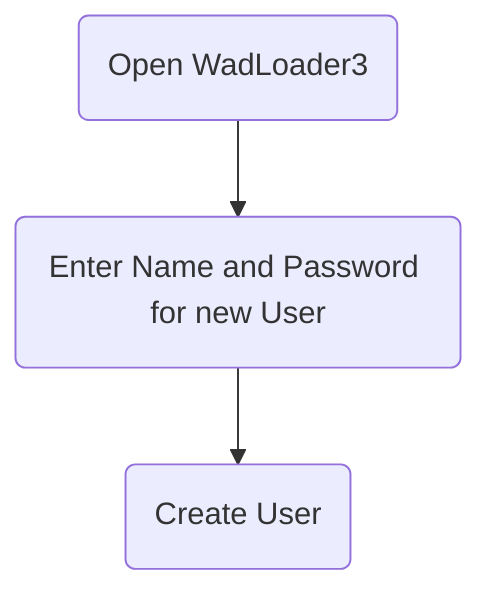
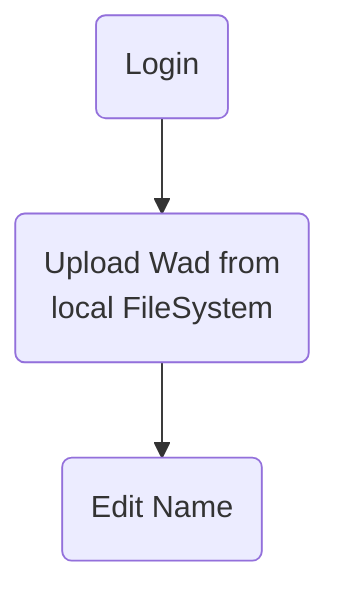
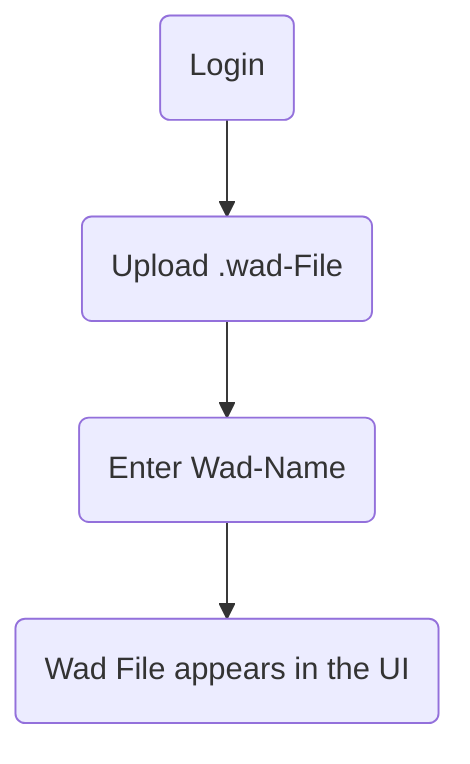
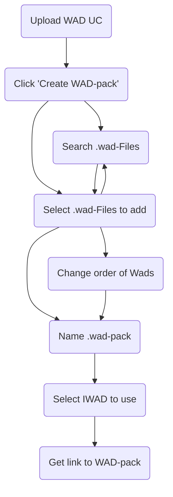
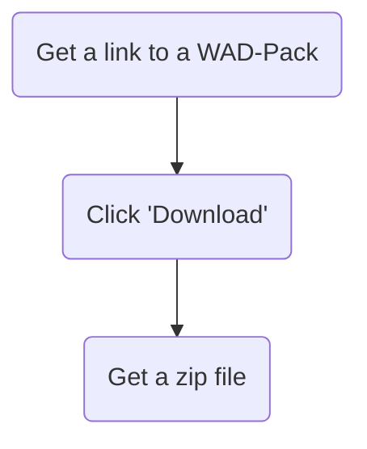
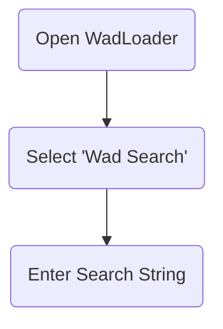
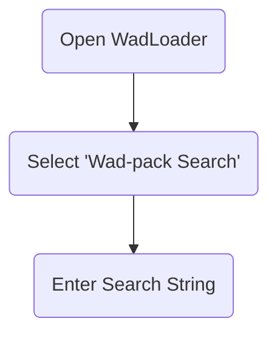

# Detaillierte Problemstellung

Computierspiele, haupstächliche solche die auf den alten Doom Spielen basierten, nutzen sogenannte WAD-Dateien um die Spiele mit neuen Inhalten anzureichern. Oft werden mehrere WADs zusammen mit einem Spiel gestartet. Dies geschieht über die Kommandozeile. Damit Multiplayer möglich ist, benötigen alle Teilnehmer die selben WADs.

Diese Probleme sollen durch eine Webanwendung - den WadLoader3 - gelöst werden. Der WadLoader3 ermöglicht das Verwalten und Teilen von WADs online. WADs können hochgeladen und verteilt werden. Mehrere WADs können zu einem sogenannten WAD-Pack gruppiert werden. Ein WAD-Pack besteht aus mehreren WADs, und einer Reihenfloge, in der die einzelnen WADs in das entsprechende Spiel geladen werden sollen. WAD-Packs können online, basierend auf allen bereits hochgeladenen WADs, erstellt und bearbeitet werden.

Die vorliegende Problemstellung dreht sich um die Entwicklung einer Webanwendung namens WadLoader. Diese ermöglicht es den, WAD-Dateien hochzuladen, zu organisieren und herunterzuladen. WAD-Dateien sind Container für Ressourcen, die von Computerspielen verwendet werden, insbesondere von Spielen, die auf der Doom-Engine basieren. Das Hauptziel der Anwendung ist es, eine benutzerfreundliche Oberfläche bereitzustellen, um diese Dateien zu verwalten und sie in Form von Paketen (WAD-Packs) zu organisieren.

# Use Cases

### Create User UC

### Login UC

### Upload WAD UC

### Create WAD Pack UC 

### Download WAD Packs UC 

### Browse Wads

### Browse Wad-Packs

# Muss-/Kann-Kriterien

Die Anwendung muss folgende Kriterien erfüllen:

- Benutzerregistrierung und -authentifizierung
- Hochladen und Verwalten von WAD-Dateien
- Erstellen, Bearbeiten und Herunterladen von WAD-Paketen
- Durchsuchen und Filtern von WAD-Dateien und -Paketen
- Integration einer geeigneten Datenbank für Persistenz

Kann-Kriterien umfassen:

- Unterstützung für mehrere Benutzerrollen (Administrator, Standardbenutzer)
- Erweiterte Such- und Filteroptionen für WAD-Dateien
- Integration von OAuth für externe Anmeldungsoptionen

# Technologieauswahl

## Begründung H2

Eine H2-Datenbank lässt sich dank der Integration in Spring Boot mit minimalem Aufwand einsetzen. Da das zu persistierende Datenmodell klein ist (zwei Entitäten), ist H2 vorerst ausreichend. Bei Bedarf kann die Datenbank einfach durch eine andere ersetzt werden.

## Begründung Spring Boot

Spring Boot ist für Java-Webanwendungen eine beliebte Wahl, da es plattformunabhängig ist und das Bereitstellen unter verschiedenen Betriebssystemen erleichtert.

## Begründung React/TS

React mit TypeScript ermöglicht die Entwicklung moderner Webanwendungen mit Material UI für ein konsistentes Benutzererlebnis.

## Begründung Haskell

Haskell bietet sich für den Client Handler an, da es plattformunabhängig ist und ohne zusätzliche Interpreter nativ ausführbar ist.

## Begründung Auth0

Authentifizierung und Authorisierung ist ein sehr komplexes und sensibles Gebiet. Das Implementieren eines OAuth2 flows ist nicht trivial. Deswegen wird Auth0, ein Anbieter für Authentification und Authorization als Service, genutzt.

Dadurch müssen vom WadLoader keine Userdaten verwaltet werden. Das Anmelden über bereits bestehende Konten (z.B. GitHub) ist möglich.

# Architektur Modelle

## Spring-Boot-Backend

Das Backend ist nach der Onion-Architektur strukturiert, um eine klare Trennung von Geschäftslogik und Infrastruktur zu gewährleisten. Diese Architektur fördert eine modulare und erweiterbare Codebasis, indem sie Schichten definiert, die sich um das zentrale Domänenmodell gruppieren.

### Infrastruktur

Die Infrastrukturschicht bildet die äußerste Schicht und enthält Implementierungen für datenbankbezogene Operationen, Dateimanagement und externe Schnittstellen. Beispielsweise umfasst sie die Implementierungen für das Zippen von Dateien oder das Verwalten des Dateisystems auf dem Server.

### API

In der API-Schicht werden die Controller definiert, die die REST-Schnittstellen zur Kommunikation mit dem Frontend und dem Client-Handler bereitstellen. Diese Schicht verwaltet auch die Umwandlung von Domain-Objekten in DTOs (Data Transfer Objects), die über das Netzwerk übertragen werden.

### Domain/Core

Die Domänenschicht bildet das Herzstück der Anwendung und enthält die Geschäftslogik sowie die zentralen Entitäten wie Wads und WadPacks. Hier werden die Kernoperationen definiert, die die Anwendungslogik implementieren und auf die Infrastrukturschicht zugreifen.

### Abstraktion

Die Abstraktionsschicht bietet allgemeine Dienste und Funktionen an, die von verschiedenen Teilen der Anwendung genutzt werden können. Beispielsweise können hier generische Dienste für fehlerresistente Operationen oder Logging implementiert werden, die nicht direkt an eine spezifische Domänenlogik gebunden sind.

/filters:no_upscale()/news/2014/10/ddd-onion-architecture/en/resources/onion-architecture.png)

### Funktionsweise

Wads werden als immutable Daten angesehen. Das hat den Vorteil, dass es nicht zu inkostistenzen kommen kann, wenn einzelne Wads gelöscht oder geupdatet werden.
Das Löschen von Wads würde die Konsistenz von WadPacks zerstören, die den Wad genutzt haben. Beim Updaen von Wads kann es, wie beim Updaten von Software, zu Fehlern und Inkonsistenzen kommen.

WadPacks können bliebig bearbeitet werden. Deswegen werden beim Herunterladen und Starten eines WadPacks, das Vorhandenshein aller benötigten Wads geprüft und ein neues Startscript heruntergeladen.

## Client Handler

Die folgende Grafik gibt eine grobe Übersicht über die Abläufe im Client Handler.

Aus den Parametern des Programmes ergibt sich eine **Action**. Diese ist eine Anweisung, welche Wads und welches Start-Skript (für ein WadPack) herunterzuladen sind. Zudem enthält die Action die URL des Servers, welcher zum Herunterladen der Wads verwendet werden soll.

Aus der Liste der benötigten Wads werden diejenigen ermittelt, welche dem Client noch nicht lokal zur Verfügung stehen.

Die Liste der noch herunterzuladenden Wads wird mit der ID des WadPacks an die URL des Servers weitergeleitet.

Der Server antwortet auf diese Anfrage mit einer .zip Datei. Diese enthält alle angeforderten Wads und eine .cmd Datei, welche das WadPack startet.
Diese .cmd Datei wird zum Ausführen eines einzelnen WadPacks genutzt.

# Screenshots und Zustände

## Create WAD

Hier ist ein Screenshot der "Create WAD"-Seite im WadLoader-Projekt. Diese Seite ermöglicht es dem Benutzer, ein neues WAD-File hochzuladen und einen Namen und eine Beschreibung dafür einzugeben.

## Create WAD Pack

Dies ist ein Beispiel für die "Create WAD Pack"-Seite. Der Benutzer kann ausgewählte WAD-Files zu einem Paket zusammenstellen, die Reihenfolge ändern und dem Paket einen Namen und eine Beschreibung geben.

## WAD List

Hier ist die Ansicht der "WAD List", die dem Benutzer ermöglicht, nach WAD-Dateien zu suchen und sie herunterzuladen.

# Run the Application

## Setup

Necessary setup to run the program.
Setting localhost:3000 is only necessary if you want to serve the frontend from vite.

1. Create Authorization Project at auth0
    * create free account at https://auth0.com
    * Create a new "Regular Web Application"
    * add "allowed callback urls": http://localhost:8080/login/oauth2/code/okta
    * add "allowed logout urls": http://localhost:3000,http://localhost:8080
    * add "allowed web origins": http://localhost:3000,http://localhost:8080
    * check "allow corss-origin authentication" and add origins: "http://localhost:3000, http://localhost:8080"
2. create file src/main/resources/application-local.properties
3. add entries for (okta.XXX values are from the auth0 project created previously):
    * spring.datasource.username
    * spring.datasource.password
    * okta.oauth2.issuer
    * okta.oauth2.client-secret
    * okta.oauth2.client-id

## Build Application

you need: 
* java: 21
* haskell: GHC2021
* node: 20 (lower should be possible as well)
* npm (js/ts build tool)
* yalc (manager for local npm packages ,can be installed via npm)
* maven (java build tool)
* cabal (haskell build tool, recommended installation via ghcup)

These steps help you to create an executable jar-file.
All steps assume the repository root as initial dir.

### Build the api

1. cd ./api-generator
2. npm install
3. npm run generate
4. npm run update

### Build haskell client (can be omitted if no changes to the haskell code were made)

1. cd ./local-client
2. cabal build
3. cp ./dist-newstyle/build/x86_64-windows/ghc-9.4.8/local-client-0.1.0.0/x/local-client/build/local-client/local-client.exe ../wadloader3/src/main/resources/local-client.exe

### Build the back- and frontend

1. cd ./wadloader3
2. yalc add wadloader3-api
3. npm install
4. npm run build
5. mvn package

## Start server

Start the application without additional parameters.

## Setup Application as a User

1. Login
2. download the setup script (by clicking the download button or calling /download/setup)
3. run the setup script with admin privileges (it can also elevate itself)

optional (if you don't set these you are asked about their values every time you start a wadpack):
4. set %GZDOOM_PATH% as the path to your gzdoom.exe
5. set %IWAD_PATH% to the path of iwad you want to use to start your WadPacks
