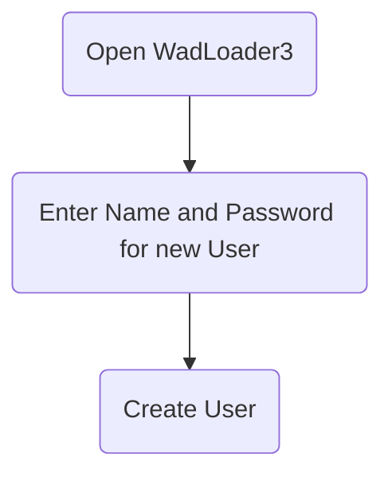
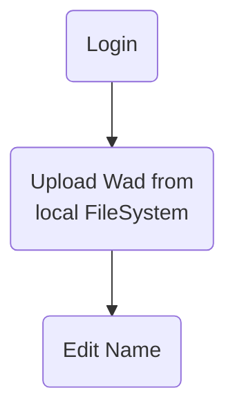
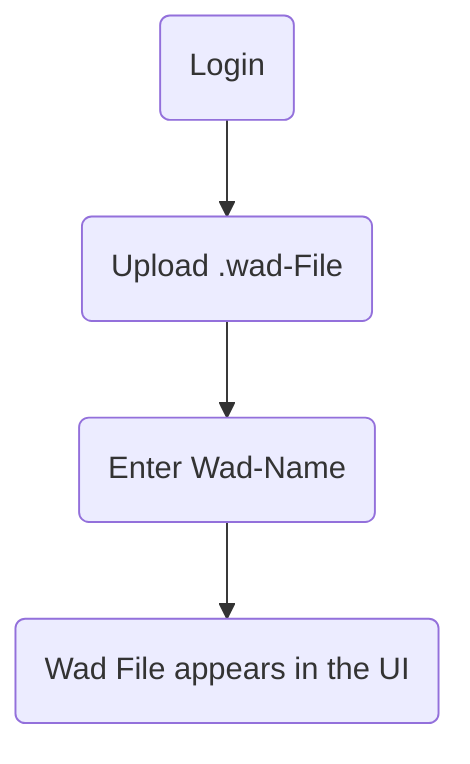
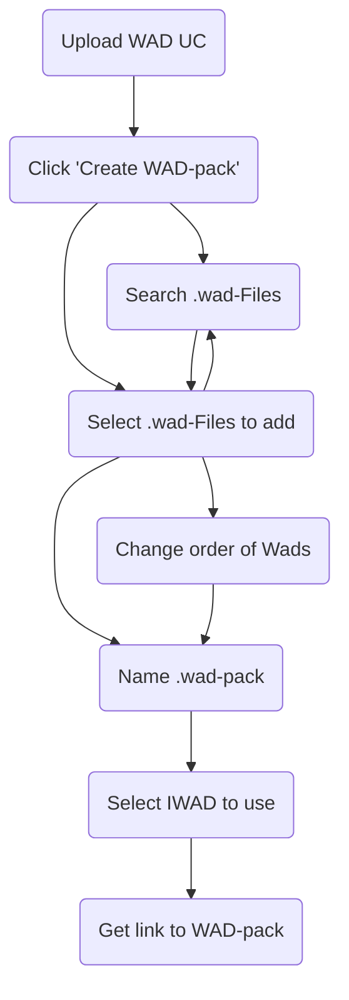
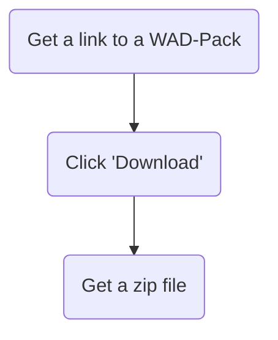
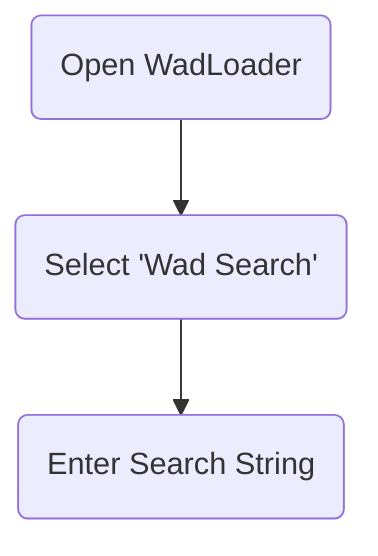
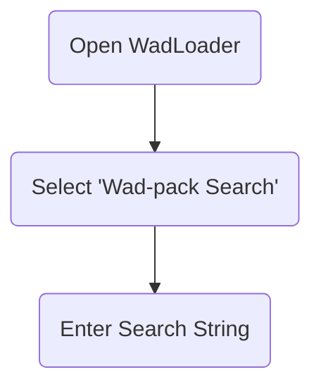
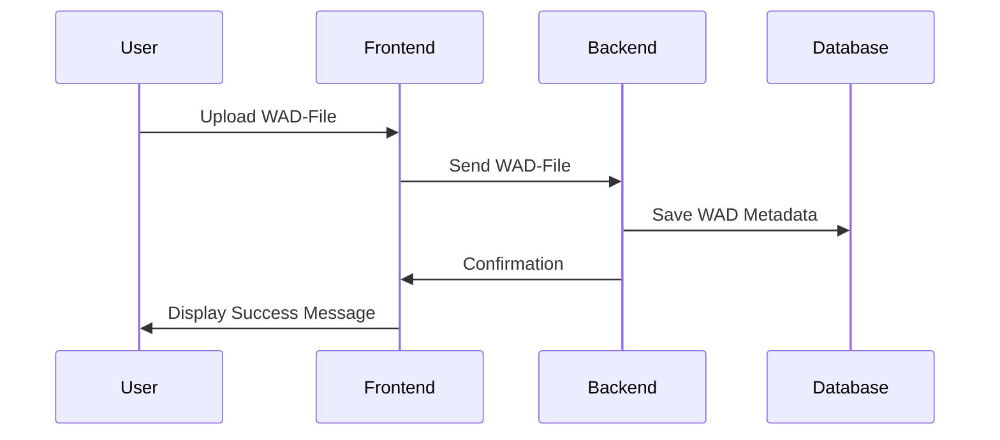
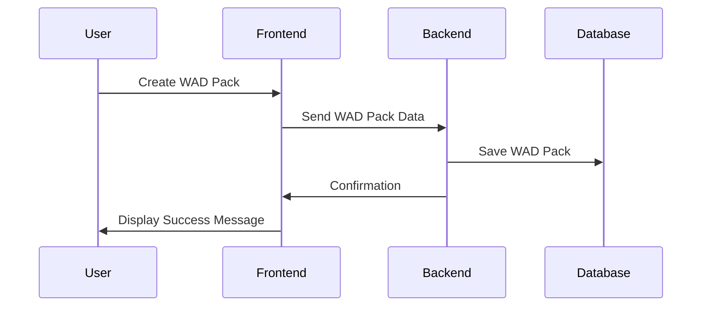
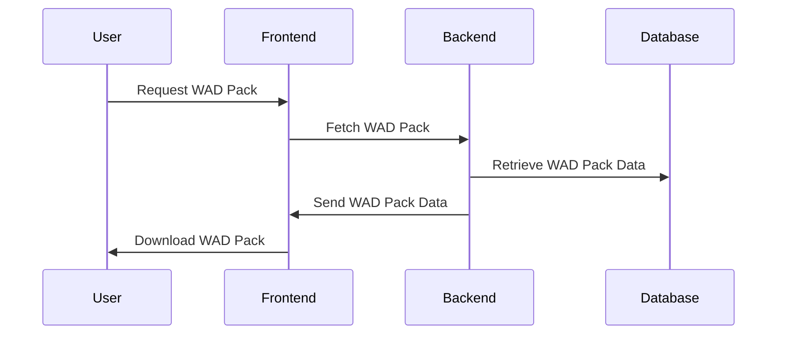

# Detaillierte Problemstellung

WAD-Dateien (Where's All the Data) sind Container für Ressourcen, die in der Doom-Engine genutzt werden. Diese Dateien sind essenziell für die Anpassung und Erweiterung des Spiels Doom. Die vorliegende Problemstellung dreht sich um die Entwicklung einer Webanwendung namens WadLoader. Diese ermöglicht es, WAD-Dateien hochzuladen, zu organisieren und herunterzuladen. Oft werden mehrere WADs zusammen verwendet, um verschiedene Szenarien oder Mods zu erstellen. Das Hauptziel der Anwendung ist es, eine benutzerfreundliche Oberfläche bereitzustellen, um diese Dateien zu verwalten und sie in Form von Modpacks (auch WAD-Packs) zu organisieren.

# Anwendungsfälle (Use Cases)

### Benutzer erstellen (Create User UC)

### Anmeldung (Login UC)

### WAD hochladen (Upload WAD UC)

### WAD-Paket erstellen (Create WAD Pack UC)

### WAD-Pakete herunterladen (Download WAD Packs UC)

### WADs durchsuchen (Browse Wads)

### WAD-Pakete durchsuchen (Browse Wad-Packs)

# Muss-/Kann-Kriterien

Die Anwendung muss folgende Kriterien erfüllen:

- Benutzerregistrierung und -authentifizierung
- Hochladen und Verwalten von WAD-Dateien
- Erstellen, Bearbeiten und Herunterladen von WAD-Paketen
- Durchsuchen und Filtern von WAD-Dateien und -Paketen
- Integration einer geeigneten Datenbank für Persistenz

Kann-Kriterien umfassen:

- Unterstützung für mehrere Benutzerrollen (Administrator, Standardbenutzer)
- Erweiterte Such- und Filteroptionen für WAD-Dateien
- Integration von OAuth für externe Anmeldungsoptionen
- Starten von WAD-Packs aus dem Browser heraus

## Umgesetzte Kriterien

Es wurden alle Muss-Kriterien implementiert. Benutzer können sich beim WadLoader registrieren und anmelden. WADs können hochgeladen und mit anderen Nutzern geteilt werden. Es ist möglich, WAD-Packs zu erstellen, zu bearbeiten und herunterzuladen. Alle WAD-Packs können mittels einer Suchfunktion gefiltert werden. Alle Änderungen werden durch eine Datenbank persistiert, somit bleiben diese auch nach einem Neustart oder Absturz des Servers erhalten.

Zusätzlich wurden auch die meisten Kann-Kriterien erfüllt. Such- und Filterfunktionalität steht auch für WADs zur Verfügung. Das Anmelden mittels OAuth ist möglich. Zudem können auch bereits existierende Accounts von externen OAuth-Anbietern (Google, Github, etc.) zum Anmelden und Registrieren genutzt werden.

# Technologieauswahl

Im Folgenden wird der Einsatz der genutzten Technologien begründet.

## Begründung H2

Eine H2-Datenbank lässt sich dank der Integration in Spring Boot mit minimalem Aufwand einsetzen. Da das zu persistierende Datenmodell klein ist (zwei Entitäten), ist H2 vorerst ausreichend. Zusätzlich haben wir bereits umfangreiche Erfahrung im Umgang mit H2, was die Implementierung und Wartung erleichtert. Bei Bedarf kann die Datenbank einfach durch eine andere ersetzt werden, was uns Flexibilität für zukünftige Erweiterungen bietet. H2 ist zudem ideal für Entwicklungs- und Testumgebungen, da sie schnell und ressourcenschonend ist. Eine In-Memory-Datenbank vereinfacht das Aufsetzen der Laufzeitumgebung, da keine eigene Datenbank installiert oder anderweitig (z.B. über Docker) bereitgestellt werden muss. Durch eine saubere Trennung der Persistenzschicht von der Domäne kann die H2-Datenbank ohne Änderungen am Kern der Anwendung ausgetauscht werden.

## Begründung Spring Boot

Spring Boot ist für Java-Webanwendungen eine beliebte Wahl, da es plattformunabhängig ist und das Bereitstellen unter verschiedenen Betriebssystemen erleichtert. Unsere Teammitglieder verfügen über fundierte Kenntnisse in Spring Boot, und wir möchten diese weiter ausbauen. In vielen Unternehmen, in denen wir tätig sind, wird Spring Boot aufgrund seiner Robustheit und des umfangreichen Ökosystems verwendet. Dies verschafft uns berufliche Vorteile. Darüber hinaus ermöglicht Spring Boot eine schnelle Entwicklung und Bereitstellung von Anwendungen durch seine konventionsbasierten Konfigurationsmöglichkeiten. Ein breites Spektrum an Spring-Integrationen ermöglicht die nahtlose Verwendung vieler anderer Frameworks und Bibliotheken. Die vergleichsweise langsamen Startzeiten von Spring Boot sind bei Anwendungen dieser Größe noch im einstelligen Sekundenbereich. Das Ausführen des Servers ist also auch auf älteren Geräten möglich.

## Begründung React/TS

React mit TypeScript ermöglicht die Entwicklung moderner Webanwendungen mit Material UI für ein konsistentes Benutzererlebnis. Wir haben bereits umfangreiche Erfahrung in der Entwicklung mit React und TypeScript. React ist in vielen Unternehmen weit verbreitet und verbessert unsere beruflichen Fähigkeiten. TypeScript bietet statische Typisierung, die die Codequalität und Wartbarkeit erhöht. Die Verwendung von Material UI sorgt für ein einheitliches und ansprechendes Design. Diese Kombination ermöglicht uns eine effiziente und fehlerarme Entwicklung. 

## Begründung Haskell

Haskell wird in diesem Projekt für den Client Handler verwendet. Dies geschieht hauptsächlich aus Experimentierfreudigkeit heraus. Es soll getestet werden, wie viel Aufwand notwendig ist, um stark auf IO-basierende Funktionalität in Haskell abzubilden. Haskell bietet sich für den Client Handler an, da es plattformunabhängig ist und ohne zusätzliche Interpreter nativ ausführbar ist. Darüber hinaus besteht im Team bereits umfangreiches Vorwissen im Bereich Haskell, was die Entwicklung erleichtert. Die Nutzung von Haskell dient zudem als Prüfungsvorbereitung für die Klausur in der Vorlesung Programmierparadigmen. Haskells starke Typensicherheit und funktionale Programmierparadigmen ermöglichen eine saubere und wartbare Codebasis, was insbesondere bei komplexen Anwendungen wie dem WadLoader von Vorteil ist. Die Nutzung von Java oder Python würde beispielsweise die Installation einer Java- bzw. Python-Laufzeit erfordern. Alternativ könnte die entsprechende Laufzeitumgebung auch mit dem Handler ausgeliefert werden, was den Client Handler jedoch aufblähen würde.

## Begründung Auth0

Authentifizierung und Autorisierung ist ein sehr komplexes und sensibles Gebiet. Das Implementieren eines OAuth2-Flows ist nicht trivial. Deswegen wird Auth0, ein Anbieter für Authentication und Authorization als Service, genutzt. Dadurch müssen vom WadLoader keine Userdaten verwaltet werden. Das Anmelden über bereits bestehende Konten (z.B. GitHub) ist möglich. Die Nutzung von Auth0 reduziert also den Entwicklungsaufwand und bringt zusätzlich viele Vorteile.

# Architekturmodelle

## Spring-Boot-Backend

Das Backend ist nach der Onion-Architektur strukturiert, um eine klare Trennung von Geschäftslogik und Infrastruktur zu gewährleisten. Diese Architektur fördert eine modulare und erweiterbare Codebasis, indem sie Schichten definiert, die sich um das zentrale Domänenmodell gruppieren.

### Infrastruktur

Die Infrastrukturschicht bildet die äußerste Schicht und enthält Implementierungen für datenbankbezogene Operationen, Dateimanagement und externe Schnittstellen. Beispielsweise umfasst sie die Implementierungen für das Zippen von Dateien oder das Verwalten des Dateisystems auf dem Server.

### API

In der API-Schicht werden die Controller definiert, die die REST-Schnittstellen zur Kommunikation mit dem Frontend und dem Client-Handler bereitstellen. Diese Schicht verwaltet auch die Umwandlung von Domain-Objekten in DTOs (Data Transfer Objects), die über das Netzwerk übertragen werden.

### Domain/Core

Die Domänenschicht bildet das Herzstück der Anwendung und enthält die Geschäftslogik sowie die zentralen Entitäten wie Wads und WadPacks. Hier werden die Kernoperationen definiert, die die Anwendungslogik implementieren und auf die Infrastrukturschicht zugreifen.

### Abstraktion

Die Abstraktionsschicht bietet allgemeine Dienste und Funktionen an, die von verschiedenen Teilen der Anwendung genutzt werden können. Beispielsweise können hier generische Dienste für fehlerresistente Operationen oder Logging implementiert werden, die nicht direkt an eine spezifische Domänenlogik gebunden sind.

## React/TS Frontend

Das React-Frontend verwendet React Hooks und Context API, um eine modulare und erweiterbare Architektur zu gewährleisten. Diese Struktur fördert die Wiederverwend

barkeit von Komponenten und eine klare Trennung von Zuständen und UI-Logik.

### Komponenten

Die Komponenten sind in atomare, molekulare und organismische Einheiten unterteilt, um eine Hierarchie der Wiederverwendbarkeit zu fördern. Atomare Komponenten bilden die Basiselemente, während molekulare Komponenten aus diesen zusammengesetzt werden und organismische Komponenten komplexere UI-Elemente darstellen.

### State Management

Das Zustandsmanagement wird hauptsächlich mit der Context API und React Hooks realisiert. Dadurch bleibt die State-Logik übersichtlich und leicht verständlich, und die Komponenten bleiben flexibel und leicht wartbar.

### Services

Die Services-Schicht enthält API-Aufrufe und andere asynchrone Operationen, die von den Komponenten genutzt werden. Diese Trennung sorgt für eine klare Struktur und erleichtert das Testen und Warten der Anwendung.

## Haskell Client Handler

Der Haskell-Client-Handler ist nach den Prinzipien der funktionalen Programmierung gestaltet, um eine saubere und wartbare Codebasis zu gewährleisten. Dies fördert die Wiederverwendbarkeit und Testbarkeit von Code.

### Monadische Struktur

Der Client Handler verwendet monadische Strukturen, um IO-Operationen und Nebenläufigkeit zu handhaben. Dies ermöglicht eine sichere und vorhersehbare Handhabung von Seiteneffekten und sorgt für eine klar strukturierte und wartbare Anwendung.

### Modularität

Die Anwendung ist modular aufgebaut, wobei jede Funktionalität in separaten Modulen implementiert ist. Dies fördert die Wiederverwendbarkeit von Code und erleichtert die Wartung und Erweiterung der Anwendung.

### Testing

Ein umfassendes Testframework wird verwendet, um die Korrektheit der Anwendung sicherzustellen. Die Tests decken alle wichtigen Funktionen und Module ab, um eine hohe Codequalität zu gewährleisten und Fehler frühzeitig zu erkennen.

## Auth0 Integration

Die Auth0-Integration ermöglicht eine sichere und skalierbare Authentifizierung und Autorisierung. Die Architektur stellt sicher, dass Auth0 nahtlos in die bestehende Anwendung integriert ist und sowohl die Benutzerverwaltung als auch die Sicherheitsanforderungen erfüllt.

### Authentifizierung

Die Authentifizierung erfolgt über Auth0, wobei Benutzer sich über verschiedene OAuth2-Provider anmelden können. Dies reduziert den Implementierungsaufwand und erhöht die Sicherheit, da Auth0 bewährte Sicherheitsmechanismen bietet.

### Autorisierung

Die Autorisierung erfolgt ebenfalls über Auth0, wobei verschiedene Benutzerrollen und Berechtigungen definiert werden können. Dies ermöglicht eine feingranulare Kontrolle über den Zugriff auf verschiedene Teile der Anwendung und gewährleistet eine hohe Sicherheit.

### Token Management

Die Verwaltung der Authentifizierungstoken wird von Auth0 übernommen, was den Aufwand für die Implementierung und Verwaltung von Sicherheitstokens reduziert. Dies erhöht die Sicherheit und Zuverlässigkeit der Anwendung.

# Sequenzdiagramme

### WAD hochladen (Upload WAD Sequence)

### WAD-Paket erstellen (Create WAD Pack Sequence)

### WAD-Paket herunterladen (Download WAD Pack Sequence)

# Fazit

Die Entwicklung des WadLoader bietet eine umfassende Lösung für die Verwaltung und Organisation von WAD-Dateien in der Doom-Engine. Durch die Verwendung moderner Technologien und bewährter Architekturprinzipien gewährleistet die Anwendung eine hohe Skalierbarkeit, Sicherheit und Benutzerfreundlichkeit. Die Implementierung aller Muss- und der meisten Kann-Kriterien zeigt die Leistungsfähigkeit und Flexibilität der gewählten Ansätze und Technologien. Die Anwendung ist bereit für den produktiven Einsatz und kann bei Bedarf leicht erweitert werden. Die gewählte Architektur und Technologie bieten eine solide Grundlage für zukünftige Erweiterungen und Anpassungen.
