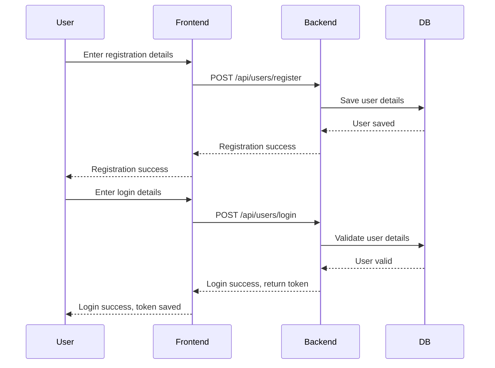
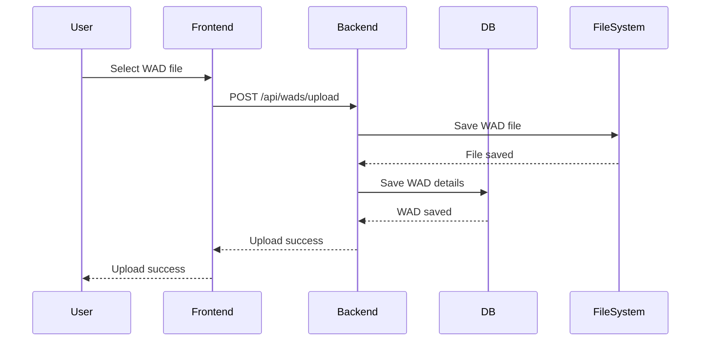

# Detaillierte Problemstellung

WAD-Dateien (Where's All the Data) sind Container für Ressourcen, die in der Doom-Engine genutzt werden. Diese Dateien sind essenziell für die Anpassung und Erweiterung des Spiels Doom. Die vorliegende Problemstellung dreht sich um die Entwicklung einer Webanwendung namens WadLoader. Diese ermöglicht es, WAD-Dateien hochzuladen, zu organisieren und herunterzuladen. Oft werden mehrere WADs zusammen verwendet, um verschiedene Szenarien oder Mods zu erstellen. Das Hauptziel der Anwendung ist es, eine benutzerfreundliche Oberfläche bereitzustellen, um diese Dateien zu verwalten und sie in Form von Modpacks (auch WAD-Packs) zu organisieren.

# Anwendungsfälle (Use Cases)

### Benutzer erstellen (Create User UC)


### Anmeldung (Login UC)


### WAD hochladen (Upload WAD UC)


### WAD-Paket erstellen (Create WAD Pack UC)


### WAD-Pakete herunterladen (Download WAD Packs UC)


### WADs durchsuchen (Browse Wads)


### WAD-Pakete durchsuchen (Browse Wad-Packs)


# Muss-/Kann-Kriterien

Die Anwendung muss folgende Kriterien erfüllen:

- Benutzerregistrierung und -authentifizierung
- Hochladen und Verwalten von WAD-Dateien
- Erstellen, Bearbeiten und Herunterladen von WAD-Paketen
- Durchsuchen und Filtern von WAD-Dateien und -Paketen
- Integration einer geeigneten Datenbank für Persistenz

Kann-Kriterien umfassen:

- Unterstützung für mehrere Benutzerrollen (Administrator, Standardbenutzer)
- Erweiterte Such- und Filteroptionen für WAD-Dateien
- Integration von OAuth für externe Anmeldungsoptionen
- Starten von WAD-Packs aus dem Browser heraus

## Umgesetzte Kriterien

Es wurden alle Muss-Kriterien implementiert. Benutzer können sich beim WadLoader registrieren und anmelden [x]. WADs können hochgeladen und mit anderen Nutzern geteilt werden [x]. Es ist möglich, WAD-Packs zu erstellen, zu bearbeiten und herunterzuladen [x]. Alle WAD-Packs können mittels einer Suchfunktion gefiltert werden [x]. Alle Änderungen werden durch eine Datenbank persistiert, somit bleiben diese auch nach einem Neustart oder Absturz des Servers erhalten [x].

Zusätzlich wurden auch die meisten Kann-Kriterien erfüllt. Such- und Filterfunktionalität steht auch für WADs zur Verfügung [x]. Das Anmelden mittels OAuth ist möglich. Zudem können auch bereits existierende Accounts von externen OAuth-Anbietern (Google, Github, etc.) zum Anmelden und Registrieren genutzt werden [x].

# Technologieauswahl

Im Folgenden wird der Einsatz der genutzten Technologien begründet.

## Begründung H2

Eine H2-Datenbank lässt sich dank der Integration in Spring Boot mit minimalem Aufwand einsetzen. Da das zu persistierende Datenmodell klein ist (zwei Entitäten), ist H2 vorerst ausreichend. Zusätzlich haben wir bereits umfangreiche Erfahrung im Umgang mit H2, was die Implementierung und Wartung erleichtert. Bei Bedarf kann die Datenbank einfach durch eine andere ersetzt werden, was uns Flexibilität für zukünftige Erweiterungen bietet. H2 ist zudem ideal für Entwicklungs- und Testumgebungen, da sie schnell und ressourcenschonend ist. Eine In-Memory-Datenbank vereinfacht das Aufsetzen der Laufzeitumgebung, da keine eigene Datenbank installiert oder anderweitig (z.B. über Docker) bereitgestellt werden muss. Durch eine saubere Trennung der Persistenzschicht von der Domäne kann die H2-Datenbank ohne Änderungen am Kern der Anwendung ausgetauscht werden.

## Begründung Spring Boot

Spring Boot ist für Java-Webanwendungen eine beliebte Wahl, da es plattformunabhängig ist und das Bereitstellen unter verschiedenen Betriebssystemen erleichtert. Unsere Teammitglieder verfügen über fundierte Kenntnisse in Spring Boot, und wir möchten diese weiter ausbauen. In vielen Unternehmen, in denen wir tätig sind, wird Spring Boot aufgrund seiner Robustheit und des umfangreichen Ökosystems verwendet. Dies verschafft uns berufliche Vorteile. Darüber hinaus ermöglicht Spring Boot eine schnelle Entwicklung und Bereitstellung von Anwendungen durch seine konventionsbasierten Konfigurationsmöglichkeiten. Ein breites Spektrum an Spring-Integrationen ermöglicht die nahtlose Verwendung vieler anderer Frameworks und Bibliotheken. Die vergleichsweise langsamen Startzeiten von Spring Boot sind bei Anwendungen dieser Größe noch im einstelligen Sekundenbereich. Das Ausführen des Servers ist also auch auf älteren Geräten möglich.

## Begründung React/TS

React mit TypeScript ermöglicht die Entwicklung moderner Webanwendungen mit Material UI für ein konsistentes Benutzererlebnis. Wir haben bereits umfangreiche Erfahrung in der Entwicklung mit React und TypeScript. React ist in vielen Unternehmen weit verbreitet und verbessert unsere beruflichen Fähigkeiten. TypeScript bietet statische Typisierung, die die Codequalität und Wartbarkeit erhöht. Die Verwendung von Material UI sorgt für ein einheitliches und ansprechendes Design. Diese Kombination ermöglicht uns eine effiziente und fehlerarme Entwicklung. 

## Begründung Haskell

Haskell wird in diesem Projekt für den Client Handler verwendet. Dies geschieht hauptsächlich aus Experimentierfreudigkeit heraus. Es soll getestet werden, wie viel Aufwand notwendig ist, um stark auf IO-basierende Funktionalität in Haskell abzubilden. Haskell bietet sich für den Client Handler an, da es plattformunabhängig ist und ohne zusätzliche Interpreter nativ ausführbar ist. Darüber hinaus besteht im Team bereits umfangreiches Vorwissen im Bereich Haskell, was die Entwicklung erleichtert. Die Nutzung von Haskell dient zudem als Prüfungsvorbereitung für die Klausur in der Vorlesung Programmierparadigmen. Haskells starke Typensicherheit und funktionale Programmierparadigmen ermöglichen eine saubere und wartbare Codebasis, was insbesondere bei komplexen Anwendungen wie dem WadLoader von Vorteil ist. Die Nutzung von Java oder Python würde beispielsweise die Installation einer Java- bzw. Python-Laufzeit erfordern. Alternativ könnte die entsprechende Laufzeitumgebung auch mit dem Handler ausgeliefert werden, was den Client Handler jedoch aufblähen würde.

## Begründung Auth0

Authentifizierung und Autorisierung ist ein sehr komplexes und sensibles Gebiet. Das Implementieren eines OAuth2-Flows ist nicht trivial. Deswegen wird Auth0, ein Anbieter für Authentication und Authorization als Service, genutzt. Dadurch müssen vom WadLoader keine Userdaten verwaltet werden. Das Anmelden über bereits bestehende Konten (z.B. GitHub) ist möglich. Die Nutzung von Auth0 reduziert also den Entwicklungsaufwand und bringt zusätzlich viele Vorteile.

# Architekturmodelle

## Spring-Boot-Backend


Das Backend ist nach der Onion-Architektur strukturiert, um eine klare Trennung von Geschäftslogik und Infrastruktur zu gewährleisten. Diese Architektur fördert eine modulare und erweiterbare Codebasis, indem sie Schichten definiert, die sich um das zentrale Domänenmodell gruppieren.

### Infrastruktur

Die Infrastrukturschicht bildet die äußerste Schicht und enthält Implementierungen für datenbankbezogene Operationen, Dateimanagement und externe Schnittstellen. Beispielsweise umfasst sie die Implementierungen für das Zippen von Dateien oder das Verwalten des Dateisystems auf dem Server.

### API

In der API-Schicht werden die Controller definiert, die die REST-Schnittstellen zur Kommunikation mit dem Frontend und dem Client-Handler bereitstellen. Diese Schicht verwaltet auch die Umwandlung von Domain-Objekten in DTOs (Data Transfer Objects), die über das Netzwerk übertragen werden.

### Domain/Core

Die Domänenschicht bildet das Herzstück der Anwendung und enthält die Geschäftslogik sowie die zentralen Entitäten wie Wads und WadPacks. Hier werden die Kernoperationen definiert, die die Anwendungslogik implementieren und auf die Infrastrukturschicht zugreifen.

### Abstraktion

Die Abstraktionsschicht bietet allgemeine Dienste und Funktionen an, die von verschiedenen Teilen der Anwendung genutzt werden können. Beispielsweise können hier generische Dienste für fehlerresistente Operationen oder Logging implementiert werden, die nicht direkt an eine spezifische Domänenlogik gebunden sind.

/articles/onion-architecture-in-action/pt1.onionarchitecture.png)

## React/TS Frontend

Das React-Frontend verwendet React Hooks und Context API, um eine modulare und erweiterbare Architektur zu gewährleisten. Diese Struktur fördert die Wiederverwendbarkeit von Komponenten und ermöglicht eine klare Trennung von Zustandsverwaltung und Darstellung.

### Komponenten

Die Komponentenschicht enthält die visuellen Bausteine der Benutzeroberfläche, die die Interaktion der Benutzer mit der Anwendung ermöglichen. Diese Komponenten sind in kleinere, wiederverwendbare Einheiten unterteilt, die zusammen die gesamte Benutzeroberfläche bilden.

### Hooks

In der Hooks-Schicht werden benutzerdefinierte Hooks definiert, die häufige Zustands- und Logikoperationen kapseln. Diese Hooks ermöglichen es, Geschäftslogik aus den Komponenten herauszulösen und wiederverwendbare Logikbausteine zu schaffen.

### Context

Die Context-Schicht verwaltet den globalen Zustand der Anwendung und stellt diesen Zustand den Komponenten über die Context API zur Verfügung. Dies ermöglicht eine zentrale Zustandsverwaltung und erleichtert die Weitergabe von Daten durch die Komponentenhierarchie.

### Services

Die Service-Schicht enthält Funktionen für die Kommunikation mit dem Backend und die Verarbeitung von Daten. Diese Schicht abstrahiert die Backend-Aufrufe und ermöglicht es, die Geschäftslogik aus den Komponenten herauszuhalten. Sie bietet auch eine zentrale Stelle für die Fehlerbehandlung und das Caching von Daten.


### Client-Handler

Der Client-Handler, entwickelt in Haskell, ist eine unabhängige Komponente, die für die direkte Interaktion mit dem Doom-Spiel verantwortlich ist. Er kommuniziert mit dem Backend und führt Befehle aus, um WADs in das Spiel zu laden und zu verwalten.

# Klassenmodelle

## Backend

Die Klassenstruktur des Backends folgt einer strengen Trennung von Domänen- und Infrastrukturklassen. Die wichtigsten Klassen sind:

- **User**: Repräsentiert einen Benutzer des WadLoader-Dienstes und enthält Informationen wie Benutzernamen, Passwort und Rollen.
- **Wad**: Repräsentiert eine hochgeladene WAD-Datei und enthält Informationen wie Dateiname, Pfad und zugehöriger Benutzer.
- **WadPack**: Repräsentiert ein WAD-Paket und enthält eine Liste von WADs sowie Metadaten wie Name und Erstellungsdatum.

Die folgenden Klassendiagramme illustrieren die Beziehungen zwischen den wichtigsten Klassen des Backends:


## Frontend

Die Klassenstruktur des Frontends ist in Komponenten unterteilt, die jeweils eine spezifische Funktionalität der Benutzeroberfläche kapseln. Die wichtigsten Klassen sind:

- **App**: Die Haupteinstiegspunkt der Anwendung, der die globalen Zustände und Routen verwaltet.
- **WadList**: Eine Komponente, die eine Liste der hochgeladenen WAD-Dateien anzeigt und deren Verwaltung ermöglicht.
- **WadPackList**: Eine Komponente, die eine Liste der erstellten WAD-Pakete anzeigt und deren Verwaltung ermöglicht.

Die folgenden Klassendiagramme illustrieren die Beziehungen zwischen den wichtigsten Klassen des Frontends:


# Komponentenmodelle

Die Anwendung ist in verschiedene Komponenten unterteilt, die jeweils eine spezifische Funktionalität kapseln. Diese Struktur ermöglicht eine modulare und erweiterbare Architektur.

## Backend-Komponenten

- **UserService**: Verwaltet die Benutzerregistrierung und -authentifizierung.
- **WadService**: Verwaltet das Hochladen, Speichern und Abrufen von WAD-Dateien.
- **WadPackService**: Verwaltet das Erstellen, Bearbeiten und Herunterladen von WAD-Paketen.


## Frontend-Komponenten

- **LoginComponent**: Ermöglicht Benutzern die Anmeldung und Registrierung.
- **UploadComponent**: Ermöglicht Benutzern das Hochladen von WAD-Dateien.
- **WadPackComponent**: Ermöglicht Benutzern das Erstellen und Verwalten von WAD-Paketen.


# Schnittstellenmodelle

Die Kommunikation zwischen den verschiedenen Komponenten der Anwendung erfolgt über definierte Schnittstellen. Diese Schnittstellen sind sowohl für die interne Kommunikation innerhalb der Anwendung als auch für die externe Kommunikation mit dem Client-Handler verantwortlich.

## Backend-APIs

Die Backend-APIs sind RESTful und ermöglichen die Kommunikation zwischen dem Frontend und dem Backend sowie dem Client-Handler. Die wichtigsten Endpunkte sind:

- **/api/users**: Verwalten von Benutzern, einschließlich Registrierung und Authentifizierung.
- **/api/wads**: Verwalten von WAD-Dateien, einschließlich Hochladen, Abrufen und Löschen.
- **/api/wadpacks**: Verwalten von WAD-Paketen, einschließlich Erstellen, Bearbeiten und Herunterladen.


## Frontend-APIs

Die Frontend-APIs sind interne Schnittstellen, die die Kommunikation zwischen den verschiedenen Komponenten des Frontends ermöglichen. Die wichtigsten Schnittstellen sind:

- **UserContext**: Bereitstellen von Benutzerinformationen und Authentifizierungsstatus für die gesamte Anwendung.
- **WadService**: Bereitstellen von Funktionen zum Hochladen, Abrufen und Löschen von WAD-Dateien.
- **WadPackService**: Bereitstellen von Funktionen zum Erstellen, Bearbeiten und Herunterladen von WAD-Paketen.


## Client-Handler-APIs

Die Client-Handler-APIs sind RESTful und ermöglichen die Kommunikation zwischen dem Client-Handler und dem Backend. Die wichtigsten Endpunkte sind:

- **/api/client/wads**: Abrufen und Verwalten von WAD-Dateien durch den Client-Handler.
- **/api/client/wadpacks**: Abrufen und Verwalten von WAD-Paketen durch den Client-Handler.


# Persistenzmodelle

Die Persistenz der Anwendung erfolgt in einer H2-Datenbank, die in das Spring-Boot-Backend integriert ist. Die wichtigsten Tabellen sind:

- **users**: Enthält Benutzerinformationen wie Benutzername, Passwort und Rollen.
- **wads**: Enthält Informationen zu hochgeladenen WAD-Dateien wie Dateiname, Pfad und zugehöriger Benutzer.
- **wadpacks**: Enthält Informationen zu erstellten WAD-Paketen wie Name, Erstellungsdatum und enthaltene WADs.


Die Beziehungen zwischen den Tabellen sind so gestaltet, dass sie eine effiziente und konsistente Datenverwaltung ermöglichen.

# Ablaufmodelle

Die wichtigsten Abläufe in der Anwendung sind:

- **Benutzerregistrierung und -authentifizierung**: Benutzer registrieren sich und melden sich an, um auf die Anwendung zuzugreifen.
- **Hochladen und Verwalten von WAD-Dateien**: Benutzer laden WAD-Dateien hoch, benennen sie und verwalten sie.
- **Erstellen und Verwalten von WAD-Paketen**: Benutzer erstellen WAD-Pakete, fügen WAD-Dateien hinzu, benennen sie und laden sie herunter.

## Benutzerregistrierung und -authentifizierung



## Hochladen und Verwalten von WAD-Dateien



## Erstellen und Verwalten von WAD-Paketen

```mermaid
sequenceDiagram
    participant User
    participant Frontend
    participant Backend
    participant DB

    User->>Frontend: Select WAD files for pack
    Frontend->>Backend: POST /api/wadpacks/create
    Backend->>DB: Save WAD pack details
    DB-->>Backend: WAD pack saved
    Backend-->>Frontend: WAD pack creation success
    Frontend-->>User: WAD pack creation success

    User->>Frontend: Download WAD pack
    Frontend

->>Backend: GET /api/wadpacks/download
    Backend->>DB: Retrieve WAD pack details
    DB-->>Backend: WAD pack details
    Backend-->>Frontend: WAD pack file
    Frontend-->>User: WAD pack downloaded
```

Diese detaillierten Ablaufmodelle veranschaulichen die verschiedenen Interaktionen und Datenflüsse innerhalb der Anwendung und bieten eine Grundlage für die Implementierung und Optimierung der einzelnen Prozesse.

# Fazit

Die Architektur des WadLoader-Dienstes ist so konzipiert, dass sie eine modulare, erweiterbare und wartbare Anwendung ermöglicht. Durch die Trennung der verschiedenen Schichten und die klare Definition der Schnittstellen kann die Anwendung leicht erweitert und angepasst werden, um den Anforderungen der Benutzer gerecht zu werden. Die Verwendung von Spring Boot, React, TypeScript und Haskell stellt sicher, dass die Anwendung sowohl leistungsfähig als auch benutzerfreundlich ist, während die strenge Trennung von Backend, Frontend und Client-Handler eine klare Struktur und einfache Wartbarkeit gewährleistet.
