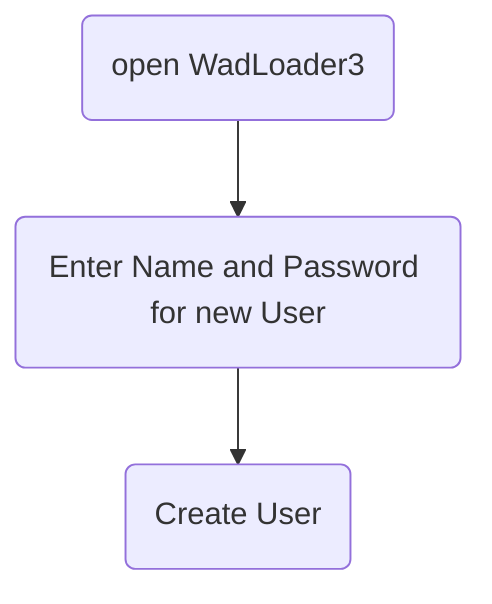
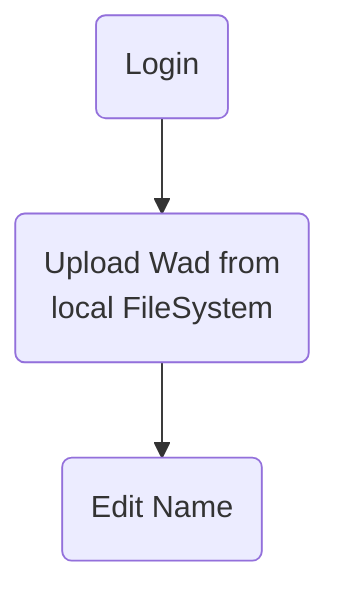
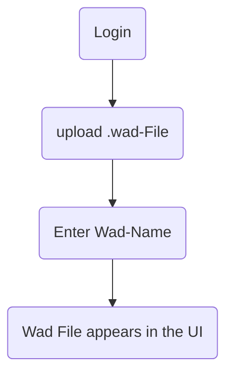
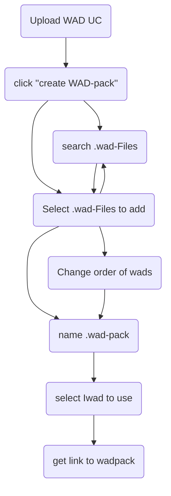
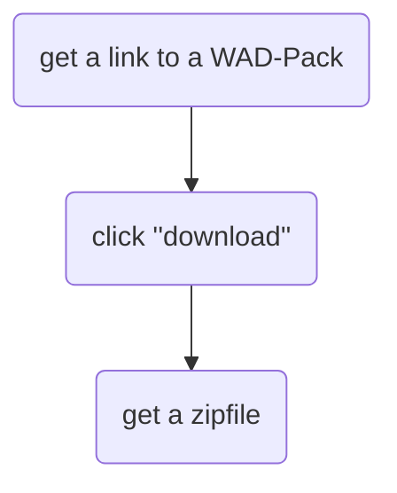
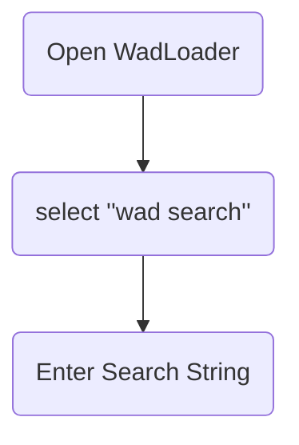
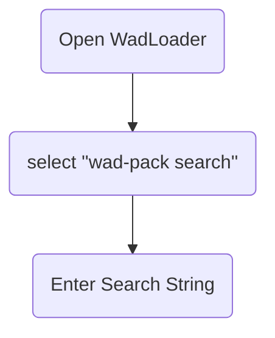

Entschuldigung für das Missverständnis. Hier ist das gesamte Dokument mit einem Deckblatt:

```markdown
---
title: Softwareprojekt Bericht - Entwicklung eines WadLoaders für Multiplayer Doom-Spiele
author: Lukas Hörnle, Maximilian Lincks
date: [Datum einfügen]
---

# Detaillierte Problemstellung

* Multiplayer Doom Spielen mit Mods ist schwierig weil:
    * Jeder braucht alle Mods
    * Jeder muss die selben Mods in der gleichen Reihenfolge haben
    * Keine standardisierte Lösung
    * Clientseitige Software optional => kein lokaler Install notwendig

# Use Cases

* .wad Dateien Archiv (upload/download wads)
* Suche über .wad-Dateien (by Name, optional über Eigenschaften z.B. Pfade))
* Login/ Logout
* Nutzerverwaltung
* Gruppieren von mehreren .wad-Dateien in Reihenfolge in "WadPacks"
    * Bearbeiten der eigenen Packs
    * Optional Kopieren der Packs anderer
* Download von einzelnen Dateien oder ganzen WadPacks
* Erstellen von Shell-Kommando zum Starten von Wads
* Optional start von Wads oder Wadspacks über lokalen Handler

# Use Cases# Usecase Upload File

## Create User UC



## Login UC



## Upload WAD UC



## create WAD Pack UC 



## Download WAD Packs UC 



## Browse Wads



## Browse Wad-Packs



# Muss-/Kann-kriterien

* Muss Disclaimer haben, dass nur Mods mit allen Rechten hochgleaden werden dürfen
* Rest: siehe Use Cases

# Technologieauswahl

* Datenbank         - H2
* Spring Boot       - Server
* React/TS          - Client
* Client Handler    - Haskell

## Begründung H2

Eine H2 Datenbank ist dank der Integration in Spring Boot mit minimalem Aufwand aufzusetzen. Da das zu persistierende Datenmodell klein ist (zwei Etitäten) ist eine H2 Datenbank auch vorerst ausreichend.

Da keine H2 spezifischen Eigenschaften genutzt wurden und Abhänigkeiten nur gegen die Spring Boot - JpaRepository Interfaces bestehen, kann die Datenbank bei bedarf auch schnell und einfach ausgewchselt werden.

## Begründung Spring Boot

Als Server wird Spring Boot genutzt. Spring Boot ist ein beliebte Wahl für Java Webanwendungen. Wir nutzen Spring Boot, weil wir mit der Technologie vertraut sind und neue gelerntes auch beruflich eingesetzt werden kann.

Spring Boot bietet den Vorteil, dass die Anwendung nicht plattformspezifisch gebunden ist. Dementsprechend ist das Bereitstellen der Anwendung unter UNIX Systemen mit weniger Aufwand möglich. 

## Begründung React/TS

Als Webfrontend nutzen wir React mit TypeScript. Reacht ermöglicht das schreiben von modernen Webanwendungen mit relativ geringem Aufwand. Als Komponenten-Bibliothek wird Material UI verwendet. Dadurch kann ein modernes, konsistenes look and feel bereitgestellt werden. 

## Begründung Haskell

Es bietet sich an den Clientseitigen Handler in einer Sprache zu schreiben, welche nativ auf dem Client ausgeführt werden kann, da dadurch kein separater Interpreter installiert werden muss.

Zudem sollte die Sprache für den Clienthandler möglichst plattform agnostisch sein. Dies ist wichtig, falls die Anwendung auch auf weiteren Plattformen, momentan wird nur Windows unterstützt, verfügbar gemacht werden sollte.

Haskell erfüllt beide Kriterien. Es ist plattfromunabhäning und kann zu einem nativen Executable (.exe) kompiliert werden. Die Nutzung von Haskell im Client Handler bietet die Möglichkeit eine Aufgabe von kleinem Umfang auf eine experimentelle Weise zu lösen.

# Architektur Modelle

## Spring-Boot-Backend

TODO: LUKAS Stuff zu ONION-Architektur
Stabiler von innen nach außen... 
Das Backend ist mit der Onion-Architektur aufgebaut. 
/filters:no_upscale()/news/2014/10/ddd-onion-architecture/en/resources/onion-architecture.png)


### Infrastructure
Die äußerste Schicht, die Infrastrukturschicht enthält Implementierungen von Interfaces aus der Domäne. Bei der FileZipperImplementation und dem FileToZipService handelt es sich um Implementierungen zum zippen mehrerer Dateien. Beide arbeiten auf dem lokalen Dateisystem des Servers. Die Implementierungen sind durch Interfaces gekaspelt, damit ein Umstieg auf einen File-Storage in der Cloud möglich ist. Auch der FsWadFileManager nutzt das lokale Dateisystem und könnte durch eine Cloud-Lösung ersetzt werden.

Der CmdTemplateManipulatorImpl bietet eine Möglichkeit zum erstellen von ausführbaren Dateien unter Windows. Der CmdTemplateManipulatorImpl liegt in der Infrastrukturschicht, da Implementierungen für das Erstellen von ausführbaren Dateien unter anderen Betriebssystemen oder Formaten zu ermöglichen.

### API
In der Api-Schicht befinden sich die Controller der Anwendung. Sie ermöglichen die Kommunikation per REST mit dem Frotend und dem Client-Handler. Zusätzlich befinden sich in dieser Schicht Mapper zum mappen von Domain-Objects zu DTOs.

Zusätzlich befinden sich hier die Sicherheitseinstellungen der Anwendung. Hier werden Filter für die Spring-SecurityFilterChain definiert.

### Domain/Core
In der Domänen/Core-Schicht wird die Applikationslogik umgesetzt. In dieser Schicht werden Interfaces definiert, welche dann von den höhren Schichten implementiert werden. Auf diese weise können Klassen auf dieser Schicht miteinander interagieren, ohne eine konkrete Kopplung an die Implementierung der Interfaces.

In dieser Schicht befindet sich das Modell der Domäne der Anewendung. Wads und WadPacks werden hier definiert. Durch Annotationen entsteht an diesen Objekten auch das Datenbank-Schema.

### Abstraction
In der Abstraction Schicht werden über die gesammte Domäne genutze Klassen implementiert. Diese sind generisch und nicht speziell an die Anwendung bezeihungsweise die Domäne gebunden.

Bei dieser Anwendung befindet sich in dieser Schicht nur die "Failable" Klasse. Durch Failables können Fehlerzustände in der Anwendung propagiert werden, ohne dass Exceptions genutzt werden. Der Kontrollfluss der Anwendung kann dadurch an die verarbeiteten Daten gekoppelt werden. Kontrollfluss und Datenfluss werden somit identisch. Das ist dadurch möglich, dass Funktionen, welche Exeptions werfen, in dem Kontext eines Failables durchgeführt werden. Beim Auftreten von Fehlern wird die Exception gefangen und die Fehlermeldung und der dazugehörige Callstack gespeichert. Definierte Operationen schlagen nach aufgetretenen Fehlern nicht fehl, sondern werden lediglich ignoriert. 

Failables ermöglichen das Arbeiten mit potenziell fehlschalgenden Operationen, ohne dass der Fehlerzustand explizit behandelt werden muss. Erst nach dem Anwenden aller notwendigen Operationen müssen Fehlerzustände behandelt werden.


## Client Handler 

Die folgende Grafik gibt eine grobe Übersicht über die Abläufe im Client

 Handler.

Aus den Parametern des Programmes ergibt sich eine **Action**. Diese ist eine Anweisung, welche Wads und welches Start-Skript (für ein WadPack) herunterzuladen sind. Zudem Enthält die Action die URL des Server, welcher zum Herunterladen der Wads verwendet werden soll.

Aus der List der benötigten Wads werden diejenigen, welche dem Client noch nicht lokal zur Verfügung stehen, ermittelt. 

Die List der noch herunterzuladenden Wads wird mit der Id des WadPacks an die URL des Servers weitergeleitet.

Der Server antwortet auf diese Anfrage mit einer .zip Datei. Diese enthält alle angeforderten Wads und eine .cmd Datei, welche das WadPack startet.


```
