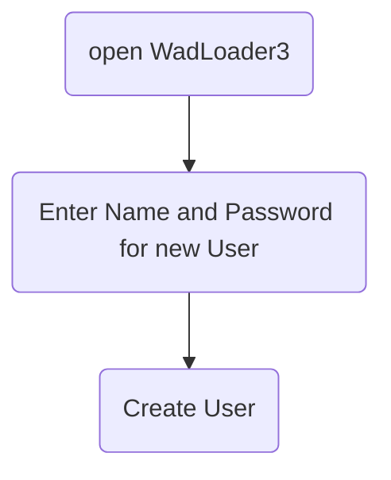
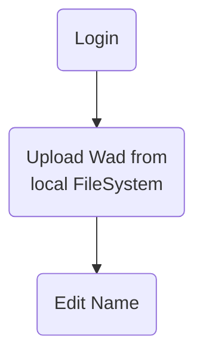
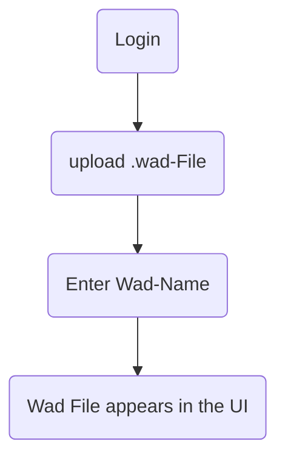
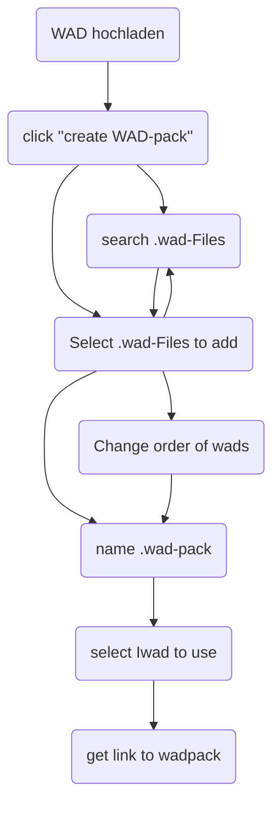
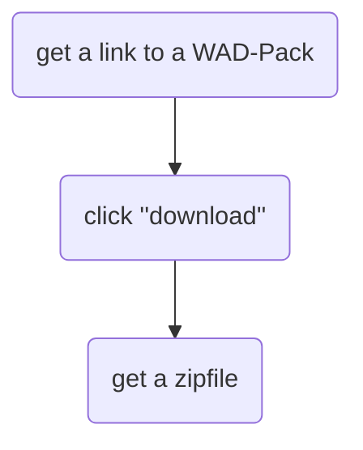
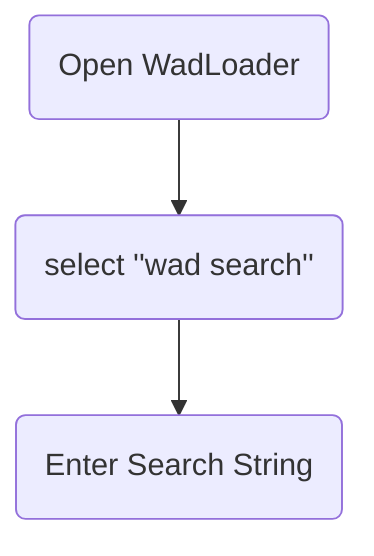
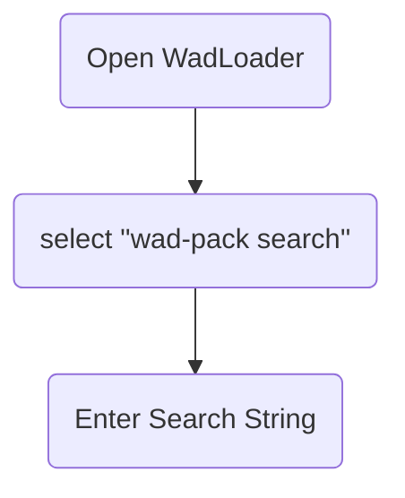

# Inhaltsverzeichnis

1. [Detaillierte Problemstellung](#detaillierte-problemstellung)
2. [Use Cases](#use-cases)
   - [Upload eines Files](#upload-eines-files)
   - [Benutzer erstellen](#benutzer-erstellen)
   - [Login](#login)
   - [WAD hochladen](#wad-hochladen)
   - [WAD Pack erstellen](#wad-pack-erstellen)
   - [WAD Packs herunterladen](#wad-packs-herunterladen)
   - [WADs durchsuchen](#wads-durchsuchen)
   - [WAD-Packs durchsuchen](#wad-packs-durchsuchen)
3. [Muss-/Kann-Kriterien](#muss--kann-kriterien)
4. [Technologieauswahl](#technologieauswahl)
   - [Begründung H2](#begründung-h2)
   - [Begründung Spring Boot](#begründung-spring-boot)
   - [Begründung React/TS](#begründung-reactts)
   - [Begründung Haskell](#begründung-haskell)
5. [Architektur Modelle](#architektur-modelle)
   - [Spring-Boot-Backend](#spring-boot-backend)
     - [Infrastruktur](#infrastruktur)
     - [API](#api)
     - [Domain/Core](#domaincore)
     - [Abstraktion](#abstraktion)
   - [Client Handler](#client-handler)

# Detaillierte Problemstellung

* Multiplayer Doom Spielen mit Mods ist schwierig, weil:
    * Jeder Spieler benötigt alle Mods.
    * Die Mods müssen in der gleichen Reihenfolge installiert sein.
    * Es gibt keine standardisierte Lösung.
    * Clientseitige Software ist optional, was lokale Installationen überflüssig macht.

# Use Cases

* Archiv für .wad-Dateien (Upload/Download von .wads)
* Suche nach .wad-Dateien (nach Namen und optional nach Eigenschaften wie Pfaden)
* Anmeldung/Abmeldung (Login/Logout)
* Nutzerverwaltung
* Gruppierung mehrerer .wad-Dateien in WadPacks
    * Bearbeiten eigener Packs
    * Optionales Kopieren von Packs anderer Nutzer
* Download einzelner Dateien oder ganzer WadPacks
* Erstellung von Shell-Befehlen zum Starten von .wads
* Optionales Starten von .wads oder WadPacks über lokalen Handler

# Upload eines Files

## Benutzer erstellen

## Login

## WAD hochladen

## WAD Pack erstellen

## WAD Packs herunterladen

## WADs durchsuchen

## WAD-Packs durchsuchen

# Muss-/Kann-Kriterien

* Muss: Es muss ein Disclaimer geben, der darauf hinweist, dass nur Mods mit allen erforderlichen Rechten hochgeladen werden dürfen.
* Kann: Siehe Use Cases.

# Technologieauswahl

* Datenbank - H2
* Server - Spring Boot
* Client - React/TS
* Client Handler - Haskell

## Begründung H2

Die Entscheidung für eine H2-Datenbank wurde aufgrund ihrer nahtlosen Integration in Spring Boot und der geringen Komplexität des Datenmodells getroffen. H2 bietet eine leichte Einrichtung und erfordert keine zusätzliche Serverinstallation, was die Entwicklung und Tests erleichtert. Für unser Projekt, das primär einfache Datenoperationen und eine überschaubare Datenmenge umfasst (zwei Hauptentitäten: Wads und WadPacks), ist H2 vorerst ausreichend. Sollte in Zukunft eine skalierbarere oder spezifischere Datenbanklösung erforderlich sein, kann H2 problemlos durch eine andere relational oder sogar NoSQL-Datenbank ersetzt werden, ohne dass dies größere Änderungen in der Anwendungslogik erfordert.

## Begründung Spring Boot

Spring Boot wurde als Servertechnologie gewählt, da es eine robuste und weit verbreitete Plattform für die Entwicklung von Java-Webanwendungen ist. Durch seine Konventionen über Konfiguration Ansätze (Convention over Configuration) minimiert Spring Boot den Konfigurationsaufwand erheblich und erleichtert das Deployment auf verschiedenen Betriebssystemen. Die Unterstützung für eingebettete Server wie Tomcat oder Jetty ermöglicht eine einfache Bereitstellung der Anwendung, ohne dass zusätzliche Serverkonfigurationen erforderlich sind. Dies ist besonders vorteilhaft für unsere Anwendung, die plattformunabhängig sein soll und unter verschiedenen Betriebssystemen (z.B. Windows, Linux) laufen muss. Die Integration mit Spring Data JPA bietet zudem eine effiziente Möglichkeit, mit der Datenbank zu interagieren und unterstützt die Umsetzung des Repository-Patterns für die Datenzugriffsschicht.

## Begründung React/TS

React in Kombination mit TypeScript wurde als Frontend-Technologie gewählt, um eine moderne und benutzerfreundliche Webanwendung zu entwickeln. React ermöglicht die modulare Entwicklung von UI-Komponenten, was die Wiederverwendbarkeit und Wartbarkeit des Codes erhöht. Die Verwendung von TypeScript bietet statische Typisierung und verbessert die Code-Qualität und Fehlererkennung während der Entwicklung. Material UI als Komponenten-Bibliothek sorgt für ein konsistentes und ansprechendes Benutzererlebnis. Diese Kombination erlaubt es uns, schnell responsive und intuitiv bedienbare Oberflächen zu gestalten, die den modernen Standards entsprechen.

## Begründung Haskell

Haskell wurde als Sprache für den Client-Handler gewählt, da sie eine hohe Portabilität bietet und nativ ausführbare Programme ohne zusätzliche Interpreter erzeugen kann. Dies ist entscheidend, da der Client-Handler plattformunabhängig sein soll und keine Abhängigkeit von spezifischen Laufzeitumgebungen haben darf. Haskell ist bekannt für seine starke Typisierung und funktionale Programmierparadigmen, die zu einer robusten und wartbaren Codebasis beitragen. Obwohl die Lernkurve etwas steiler ist, bietet Haskell durch seine strikten Typen und seine reine funktionale Natur eine solide Grundlage für die Implementierung des Client-Handlers.

# Architektur Modelle

## Spring-Boot-Backend

Das Backend ist nach der Onion-Architektur strukturiert, um eine klare Trennung von Geschäftslogik und Infrastruktur zu gewährleisten. Diese Architektur fördert eine modulare und erweiterbare Codebasis, indem sie Schichten definiert, die sich um das zentrale Domänenmodell gruppieren. 

### Infrastruktur

Die Infrastrukturschicht bildet die äußerste Schicht und enthält Implementierungen für datenbankbezogene Operationen, Dateimanagement und externe Schnittstellen. Beispielsweise umfasst sie die Implementierungen für das Zippen von Dateien oder das Verwalten des Dateisystems auf dem Server.

### API

In der API-Schicht werden die Controller definiert, die die REST-Schnittstellen zur Kommunikation mit dem Frontend und dem Client-Handler bereitstellen. Diese Schicht verwaltet auch die Umwandlung von Domain-Objekten in DTOs (Data Transfer Objects), die über das Netzwerk übertragen werden.

### Domain/Core

Die Domänenschicht bildet das Herzstück der Anwendung und enthält die Geschäftslogik sowie die zentralen Entitäten wie Wads und WadPacks. Hier werden die Kernoperationen definiert, die die Anwendungslogik implementieren und auf die Infrastrukturschicht zugreifen.

### Abstraktion

Die Abstraktionsschicht bietet allgemeine Dienste und Funktionen an, die von verschiedenen Teilen der Anwendung genutzt werden können. Beispielsweise können hier generische Dienste für fehlerresistente Operationen oder Logging implementiert werden, die nicht direkt an eine spezifische Domänenlogik gebunden sind.

/filters:no_upscale()/news/2014/10/ddd-onion-architecture/en/resources/onion-architecture.png)

## Client Handler

Die Grafik zeigt die grundlegenden Abläufe im Haskell-basierten Client Handler.

Eine **Aktion** definiert die herunterzuladenden Wads und das Startskript für ein WadPack. Die URL des Servers wird angegeben.

Die noch nicht lokal verfügbaren Wads werden ermittelt und zur Server-URL gesendet.

Der Server antwortet mit einer .zip Datei, die alle angeforderten Wads und ein .cmd Startskript enthält.

