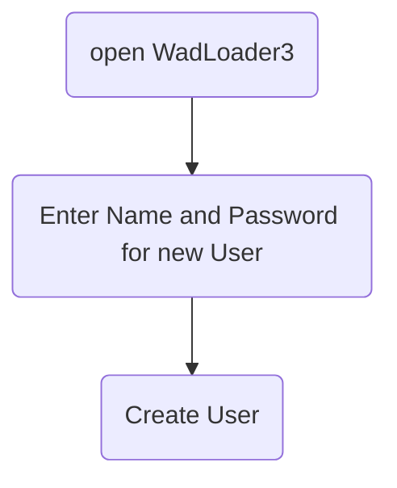
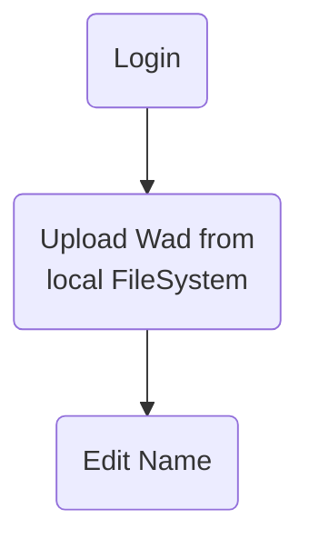
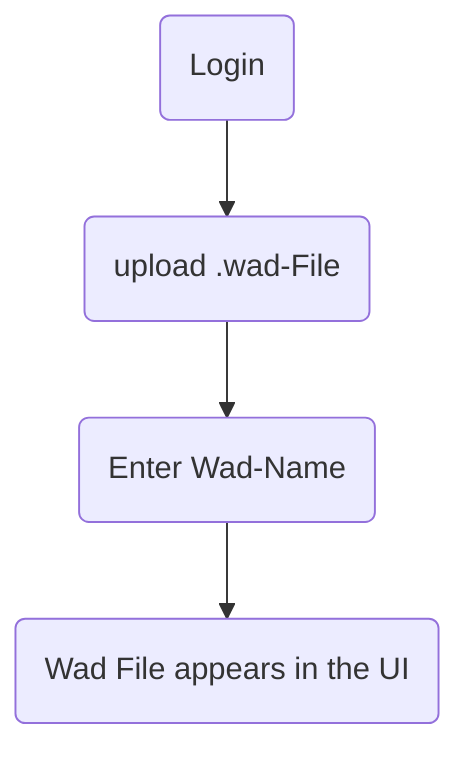
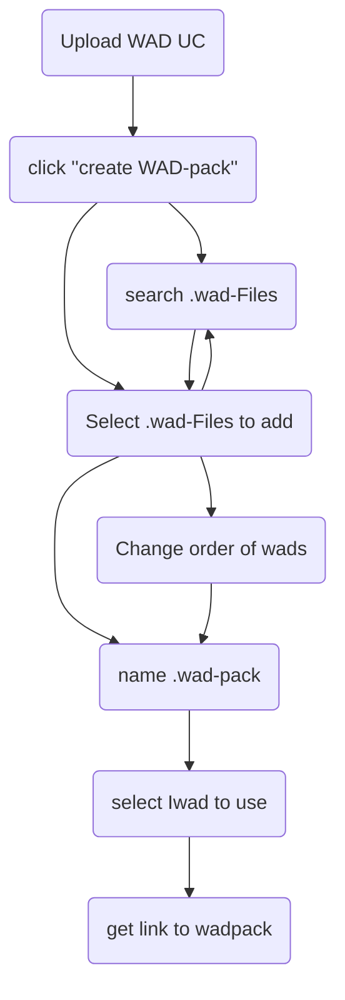
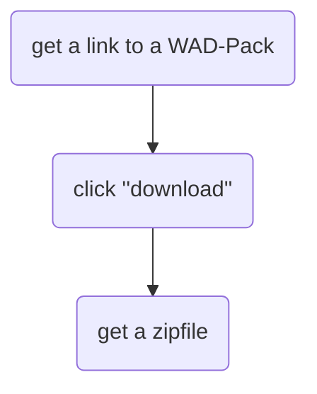
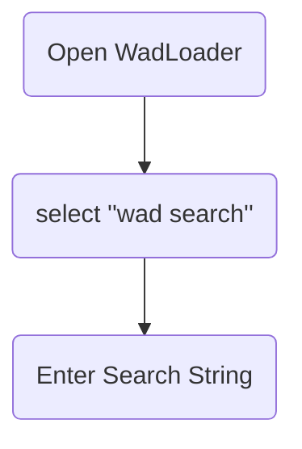
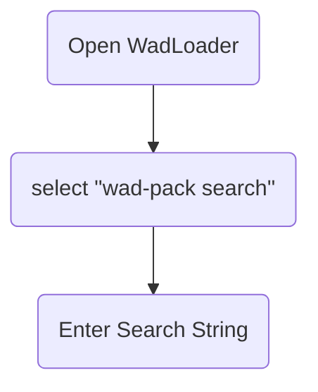

# Detaillierte Problemstellung
* Multiplayer Doom Spielen mit Mods ist schwierig weil:
    * Jeder braucht alle Mods (gleiche Version)
    * Jeder muss die selben Mods in der gleichen Reihenfolge haben
    * Keine standardtisierte Lösung

* Das verwalten vieler .wad-Dateinen ist unkonfortabel
   * viele Dateien in einem Ordner order verteiltet auf mehrere Ordner: unübersichtlich
   * manche Mods funktionieren nur zusammen mit anderen
   * um mehrere Mods zu starten müssen diese als Kommandozeilenparameter der Doom-Engine übergeben werden
      * gewissen technisches Verständniss notwendig
      * nicht konfortabel
   * man muss sich merken, welche Mods für welchen Speicherstand benötigt werden
    

# Use Cases
* .wad Dateien Archiv (upload/download wads)
* Suche über .wad-Dateien (by Name, optional über Eigenschaften z.B. Pfade))
* Login/ Logout
* Nutzerverwaltung
* Gruppieren von mehreren .wad-Dateien in Reihenfolge in "WadPacks"
    * Bearbeiten der eigenen Packs
    * Optional Kopieren der Packs anderer
* Download von einzelnen Dateien oder ganzen WadPacks
* Erstellen von Shell-Kommando zum Starten von Wads
* Optional start von Wads oder Wadspacks über lokalen handler
# Use Cases# Usecase Upload File
## Create User UC

## Login UC

## Upload WAD UC

## create WAD Pack UC 

## Download WAD Packs UC 

## Browse Wads

## Browse Wad-Packs

# Muss-/Kann-kriterien
* Muss Disclaimer haben, dass nur Mods mit allen Rechten hochgleaden werden dürfen
* Rest: siehe Use Cases

# Technologieauswahl
* H2 Datenbank? Oder postgres SQL
* Spring Boot Server
* React/ TS Client
* ??? Für optionalen client side Handler
