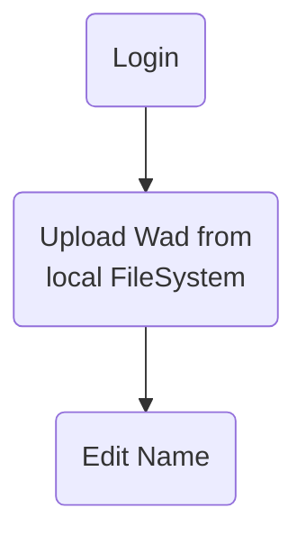

# Use Cases

* Login 
* upload WadFiles
* group wads as wadpack (& configure loading order)
* download wad/wadpack
* view/search other wadpacks, edit yours
* view/search wads
* download cmd file to start wads/wadpacks in Gzdoom
* optional: start wad/wadpack from browser

# Uscase Upload File
