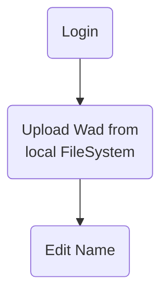
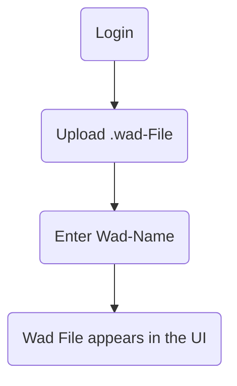
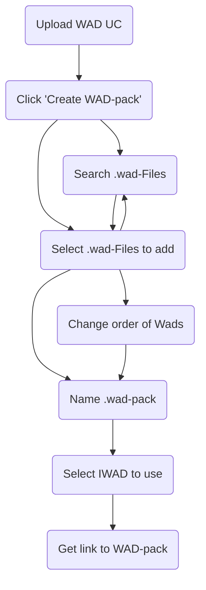
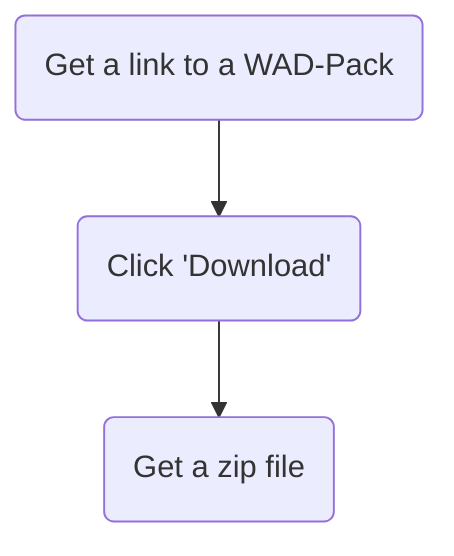
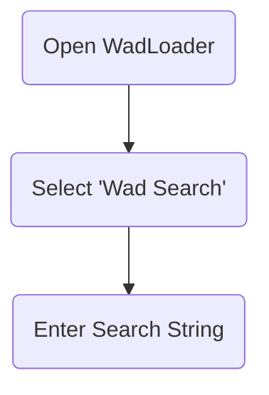
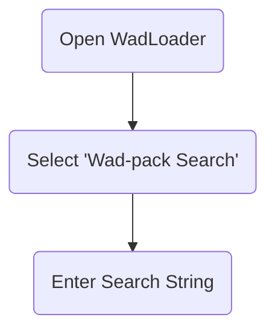

# Detaillierte Problemstellung

Die vorliegende Problemstellung dreht sich um die Entwicklung einer Webanwendung namens WadLoader, die es Benutzern ermöglicht, WAD-Dateien hochzuladen, zu organisieren und herunterzuladen. WAD-Dateien sind Container für Ressourcen, die von Computerspielen verwendet werden, insbesondere von Spielen, die auf der Doom-Engine basieren. Das Hauptziel der Anwendung ist es, eine benutzerfreundliche Oberfläche bereitzustellen, um diese Dateien zu verwalten und sie in Form von Paketen (WAD-Packs) zu organisieren.

# Use Cases

## Upload File

### Create User UC

### Login UC

### Upload WAD UC

### Create WAD Pack UC 

### Download WAD Packs UC 

### Browse Wads

### Browse Wad-Packs

# Muss-/Kann-Kriterien

Die Anwendung muss folgende Kriterien erfüllen:

- Benutzerregistrierung und -authentifizierung
- Hochladen und Verwalten von WAD-Dateien
- Erstellen, Bearbeiten und Herunterladen von WAD-Paketen
- Durchsuchen und Filtern von WAD-Dateien und -Paketen
- Integration einer geeigneten Datenbank für Persistenz

Kann-Kriterien umfassen:

- Unterstützung für mehrere Benutzerrollen (Administrator, Standardbenutzer)
- Erweiterte Such- und Filteroptionen für WAD-Dateien
- Integration von OAuth für externe Anmeldungsoptionen

# Technologieauswahl

## Begründung H2

Eine H2-Datenbank lässt sich dank der Integration in Spring Boot mit minimalem Aufwand einsetzen. Da das zu persistierende Datenmodell klein ist (zwei Entitäten), ist H2 vorerst ausreichend. Bei Bedarf kann die Datenbank einfach durch eine andere ersetzt werden.

## Begründung Spring Boot

Spring Boot ist für Java-Webanwendungen eine beliebte Wahl, da es plattformunabhängig ist und das Bereitstellen unter verschiedenen Betriebssystemen erleichtert.

## Begründung React/TS

React mit TypeScript ermöglicht die Entwicklung moderner Webanwendungen mit Material UI für ein konsistentes Benutzererlebnis.

## Begründung Haskell

Haskell bietet sich für den Client Handler an, da es plattformunabhängig ist und ohne zusätzliche Interpreter nativ ausführbar ist.

# Architektur Modelle

## Spring-Boot-Backend

Das Backend ist nach der Onion-Architektur strukturiert, um eine klare Trennung von Geschäftslogik und Infrastruktur zu gewährleisten. Diese Architektur fördert eine modulare und erweiterbare Codebasis, indem sie Schichten definiert, die sich um das zentrale Domänenmodell gruppieren.

### Infrastruktur

Die Infrastrukturschicht bildet die äußerste Schicht und enthält Implementierungen für datenbankbezogene Operationen, Dateimanagement und externe Schnittstellen. Beispielsweise umfasst sie die Implementierungen für das Zippen von Dateien oder das Verwalten des Dateisystems auf dem Server.

### API

In der API-Schicht werden die Controller definiert, die die REST-Schnittstellen zur Kommunikation mit dem Frontend und dem Client-Handler bereitstellen. Diese Schicht verwaltet auch die Umwandlung von Domain-Objekten in DTOs (Data Transfer Objects), die über das Netzwerk übertragen werden.

### Domain/Core

Die Domänenschicht bildet das Herzstück der Anwendung und enthält die Geschäftslogik sowie die zentralen Entitäten wie Wads und WadPacks. Hier werden die Kernoperationen definiert, die die Anwendungslogik implementieren und auf die Infrastrukturschicht zugreifen.

### Abstraktion

Die Abstraktionsschicht bietet allgemeine Dienste und Funktionen an, die von verschiedenen Teilen der Anwendung genutzt werden können. Beispielsweise können hier generische Dienste für fehlerresistente Operationen oder Logging implementiert werden, die nicht direkt an eine spezifische Domänenlogik gebunden sind.

/filters:no_upscale()/news/2014/10/ddd-onion-architecture/en/resources/onion-architecture.png)

## Client Handler

Die folgende Grafik gibt eine grobe Übersicht über die Abläufe im Client Handler.

Aus den Parametern des Programmes ergibt sich eine **Action**. Diese ist eine Anweisung, welche Wads und welches Start-Skript (für ein WadPack) herunterzuladen sind. Zudem enthält die Action die URL des Servers, welcher zum Herunterladen der Wads verwendet werden soll.

Aus der Liste der benötigten Wads werden diejenigen ermittelt, welche dem Client noch nicht lokal zur Verfügung stehen.

Die Liste der noch herunterzuladenden Wads wird mit der ID des WadPacks an die URL des Servers weitergeleitet.

Der Server antwortet auf diese Anfrage mit einer .zip Datei. Diese enthält alle angeforderten Wads und eine .cmd Datei, welche das WadPack startet.

# Screenshots und Zustände

## Create WAD

Hier ist ein Screenshot der "Create WAD"-Seite im WadLoader-Projekt. Diese Seite ermöglicht es dem Benutzer, ein neues WAD-File hochzuladen und einen Namen und eine Beschreibung dafür einzugeben.

## Create WAD Pack

Dies ist ein Beispiel für die "Create WAD Pack"-Seite. Der Benutzer kann ausgewählte WAD-Files zu einem Paket zusammenstellen, die Reihenfolge ändern und dem Paket einen Namen und eine Beschreibung geben.

## WAD List

Hier ist die Ansicht der "WAD List", die dem Benutzer ermöglicht, nach WAD-Dateien zu suchen und sie herunterzuladen.

