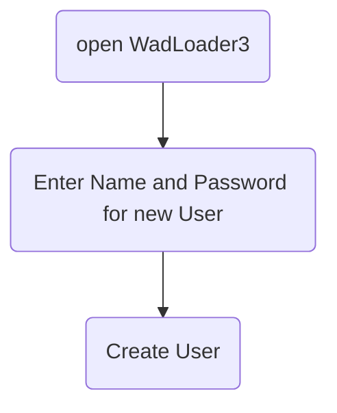
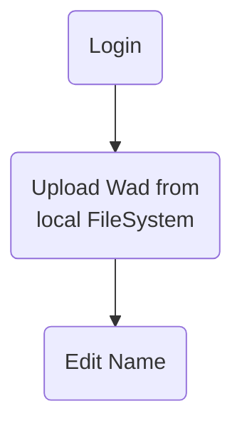
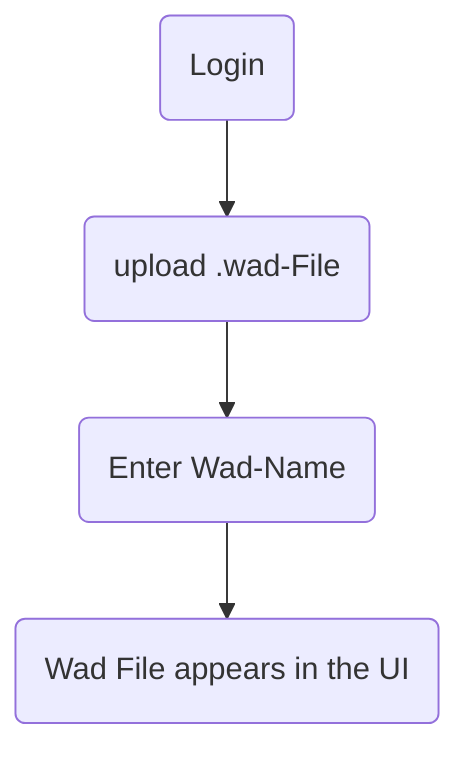
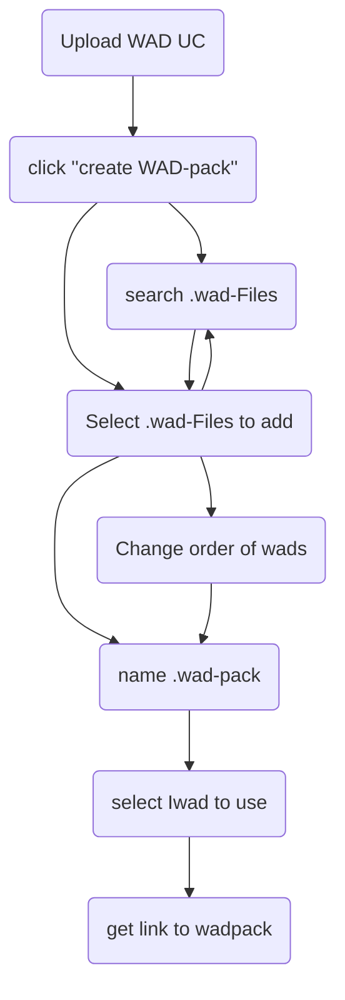
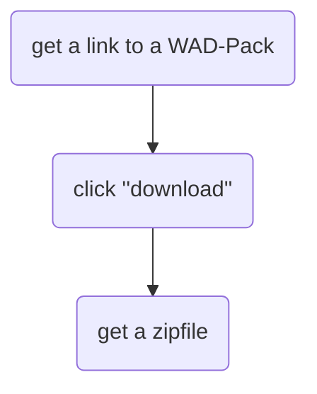
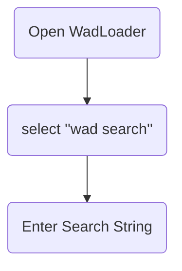
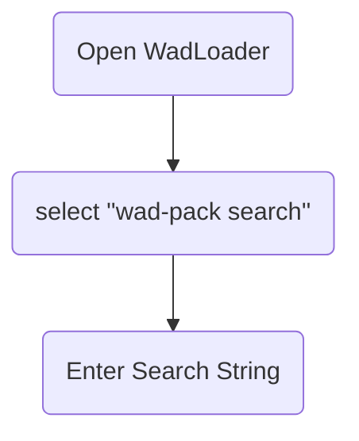

# Detaillierte Problemstellung

* Multiplayer Doom Spielen mit Mods ist schwierig weil:
    * Jeder Spieler benötigt alle Mods.
    * Die Mods müssen in der gleichen Reihenfolge installiert sein.
    * Es gibt keine standardisierte Lösung.
    * Clientseitige Software ist optional, was lokale Installationen überflüssig macht.

# Use Cases

* Archiv für .wad-Dateien (Upload/Download von .wads)
* Suche nach .wad-Dateien (nach Namen und optional nach Eigenschaften wie Pfaden)
* Anmeldung/Abmeldung (Login/Logout)
* Nutzerverwaltung
* Gruppierung mehrerer .wad-Dateien in WadPacks
    * Bearbeiten eigener Packs
    * Optionales Kopieren von Packs anderer Nutzer
* Download einzelner Dateien oder ganzer WadPacks
* Erstellung von Shell-Befehlen zum Starten von .wads
* Optionales Starten von .wads oder WadPacks über lokalen Handler

# Use Cases# Usecase Upload File

## Create User UC

## Login UC

## Upload WAD UC

## create WAD Pack UC 

## Download WAD Packs UC 

## Browse Wads

## Browse Wad-Packs

# Muss-/Kann-kriterien

* Muss: Es muss ein Disclaimer geben, der darauf hinweist, dass nur Mods mit allen erforderlichen Rechten hochgeladen werden dürfen.
* Kann: Siehe Use Cases.

# Technologieauswahl

* Datenbank - H2
* Server - Spring Boot
* Client - React/TS
* Client Handler - Haskell

## Begründung H2

Eine H2-Datenbank lässt sich dank der Integration in Spring Boot mit minimalem Aufwand einsetzen. Da das zu persistierende Datenmodell klein ist (zwei Entitäten), ist H2 vorerst ausreichend. Bei Bedarf kann die Datenbank einfach durch eine andere ersetzt werden.

## Begründung Spring Boot

Spring Boot ist für Java-Webanwendungen eine beliebte Wahl, da es plattformunabhängig ist und das Bereitstellen unter verschiedenen Betriebssystemen erleichtert.

## Begründung React/TS

React mit TypeScript ermöglicht die Entwicklung moderner Webanwendungen mit Material UI für ein konsistentes Benutzererlebnis.

## Begründung Haskell

Haskell bietet sich für den Client Handler an, da es plattformunabhängig ist und ohne zusätzliche Interpreter nativ ausführbar ist.

# Architektur Modelle

## Spring-Boot-Backend

Das Backend ist nach der Onion-Architektur strukturiert, um eine klare Trennung von Geschäftslogik und Infrastruktur zu gewährleisten.

/filters:no_upscale()/news/2014/10/ddd-onion-architecture/en/resources/onion-architecture.png)

### Infrastruktur

Die äußerste Schicht enthält Implementierungen für die Infrastruktur, z.B. zum Zippen von Dateien oder zum Verwalten des Dateisystems.

### API

Hier befinden sich die Controller für die REST-Kommunikation mit Frontend und Client Handler sowie Mapper für die DTOs.

### Domain/Core

Die Kernschicht enthält die Geschäftslogik, Modelle wie Wads und WadPacks sowie Schnittstellen für die Anwendungslogik.

### Abstraktion

Generische Klassen, z.B. für fehlerresistente Operationen, werden hier implementiert.

## Client Handler

Die Grafik zeigt die grundlegenden Abläufe im Haskell-basierten Client Handler.

Eine **Aktion** definiert die herunterzuladenden Wads und das Startskript für ein WadPack. Die URL des Servers wird angegeben.

Die noch nicht lokal verfügbaren Wads werden ermittelt und zur Server-URL gesendet.

Der Server antwortet mit einer .zip Datei, die alle angeforderten Wads und ein .cmd Startskript enthält.

